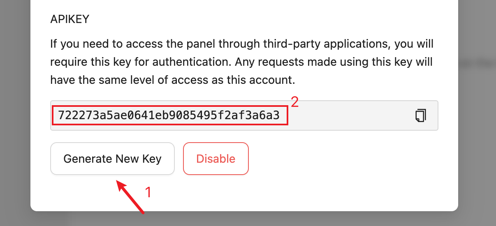

# API Tutorial

## API Key

:::tip
If you are on an admin account, your API key will also have admin privileges. Please do <b>not</b> disclose your API key.
:::

As shown in the image,


Generate and copy this API key, it will have the same rights as your current account.



:::warning 
Please fill in all parameters, even if they are blank. Otherwise, there may be malfunctions in the API response.
:::

## Example Usages

Suppose you are an admin, and you want to use the API to `get a list of daemons`. You need to use any programming language or HTTP tool to send the following request:

```bash
GET http://example.com/api/service/remote_services_system?apikey=<User Api Key>
Content-Type: application/json; charset=utf-8
X-Requested-With: XMLHttpRequest
```

:::warning
If not otherwise specified, **these HTTP request headers are required**.

- X-Requested-With: XMLHttpRequest
- Content-Type: application/json; charset=utf-8

:::

You will get all daemon's data:

```json
{
  // status parameter
  // 200: Normal, and returns the corresponding content
  // 400: Incorrect request parameters
  // 403: Insufficient permissions
  // 500: Program error
  "status": 200,
  // Responded node list
  "data": [
    {
      "version": "3.9.0",
      "process": {
        "cpu": 5625000,
        "memory": 132437320,
        "cwd": "D:\\Workspace\\MCSM\\MCSManager-Daemon"
      },
      "instance": {
        "running": 1,
        "total": 6
      },
      "system": {
        "type": "Windows_NT",
        "hostname": "MyComputer",
        "platform": "win32",
        "release": "11.0.22000",
        "uptime": 410445,
        "cwd": "D:\\Workspace\\MCSM\\MCSManager-Daemon",
        "loadavg": [0, 0, 0],
        "freemem": 5700775936,
        "cpuUsage": 0.0490009222256379,
        "memUsage": 0.6651475749266619,
        "totalmem": 17024741376,
        "processCpu": 0,
        "processMem": 0
      }
    }
  ],
  // The time when the request finished processing, can be used to measure latency.
  "time": 1643879914006
}
```
