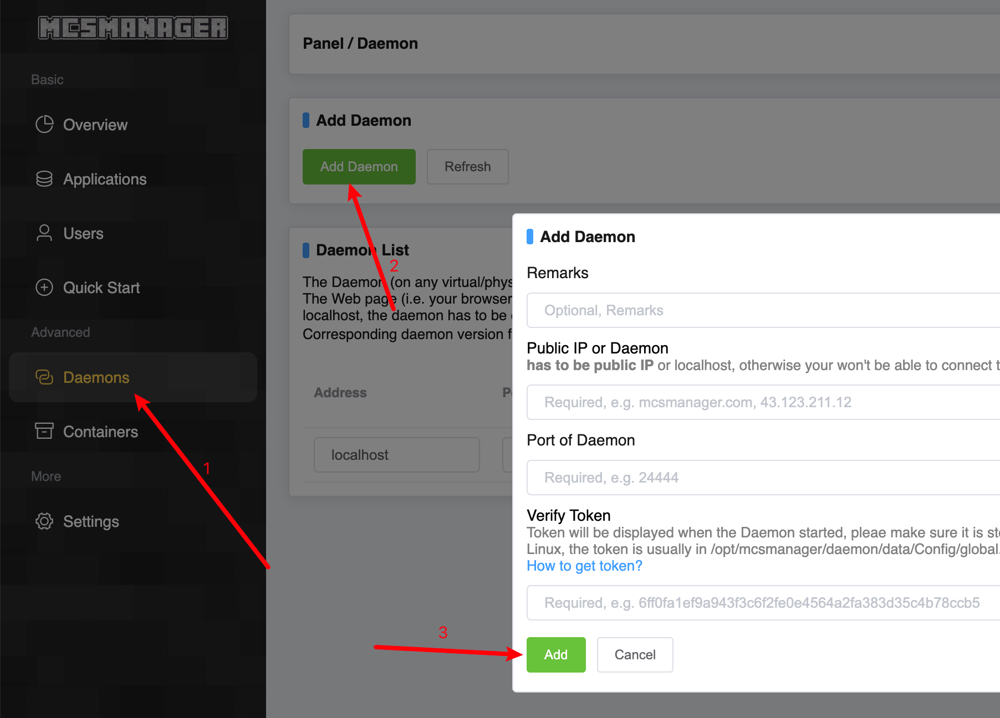

# Adding a Daemon to Web Panel

## Install Daemon on the target machine.

Make sure MCSM Daemon was installed on the target machine.
Refers to [Installation](getting-started/manual-install.md) for instructions.
If you installed both daemon and web panel on the target machine, you may want to disable the web panel. 

```bash
# If not already, start the Daemon service.
systemctl start mcsm-daemon

# STOP web panel, and prevent it from run on startup.
systemctl stop mcsm-web
systemctl disable mcsm-web 
```

## Add Daemon to Web Panel

### Obtain the remote daemon access token
On the target machine, run the following command
```
cat /opt/mcsmanager/daemon/data/Config/global.json
```
Example output:
```json
{
    "version": 2,       
    "ip": "",           
    "port": 24444,      
    "key": "9aad9b81f8794a7720b28f....d4bb489c495cf29a88e7b",   // Copy this   
    "maxFileTask": 2,       
    "maxZipFileSize": 60, 
    "language": "en_us",
    "defaultInstancePath": ""
}
```
Copy the value of key(Token) from the above file. This key will also be displaed when Daemon service starts.

### Configure the web panel
Go to your web panel, and do the following:

