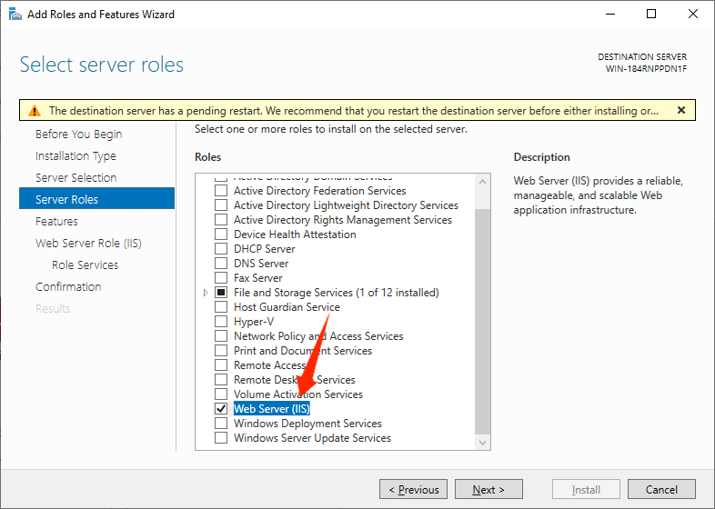
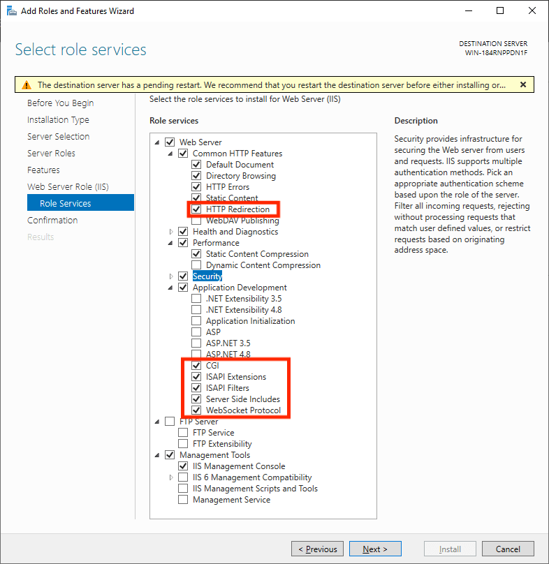
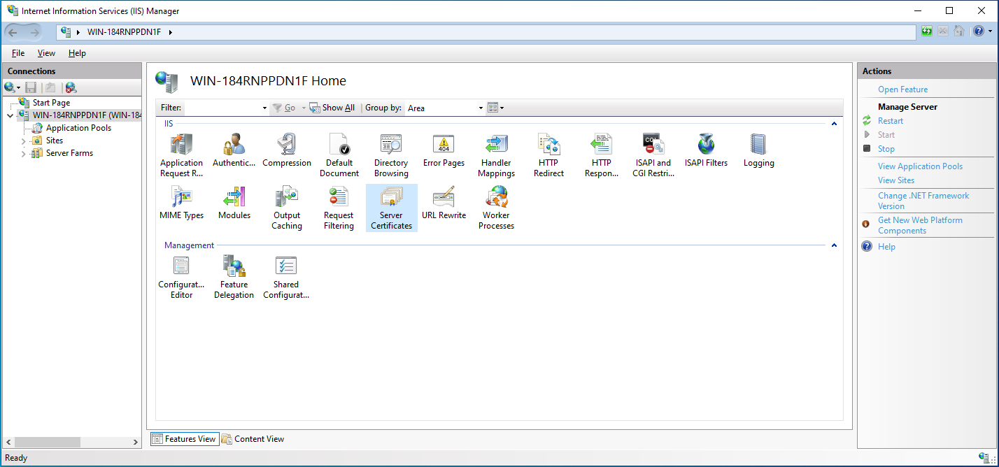
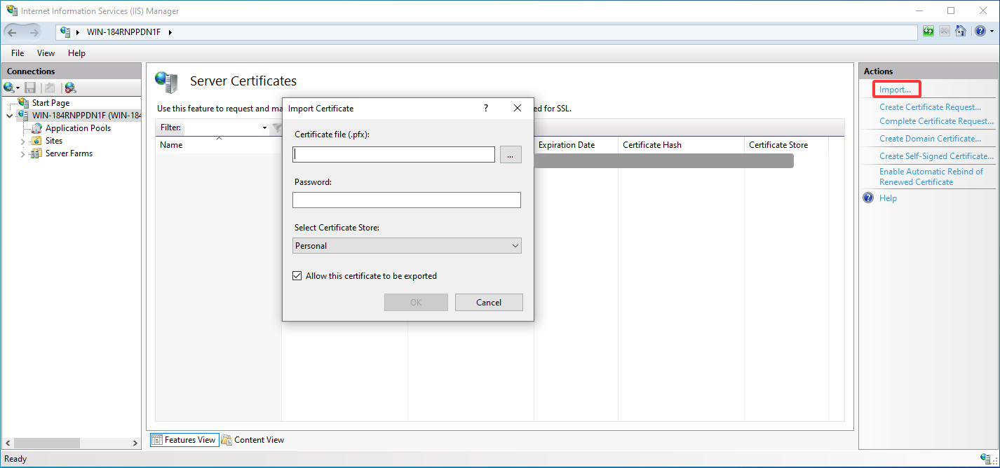
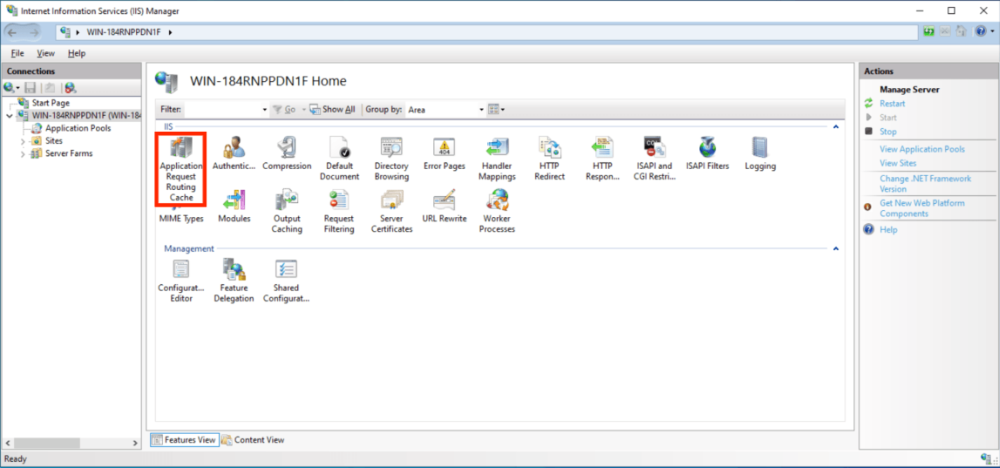
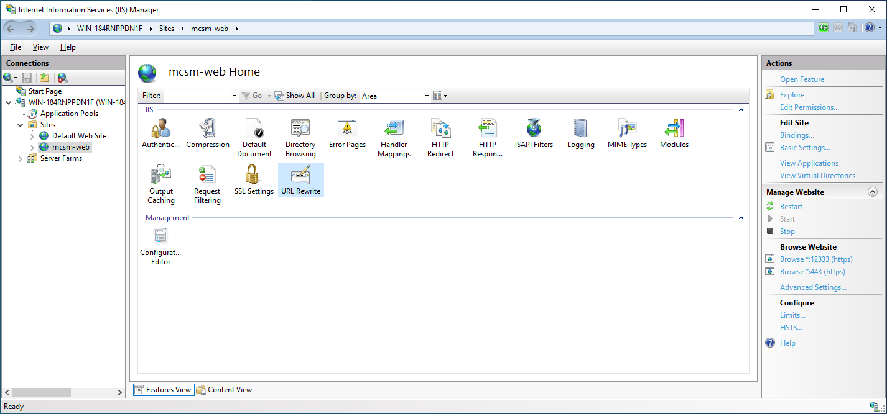
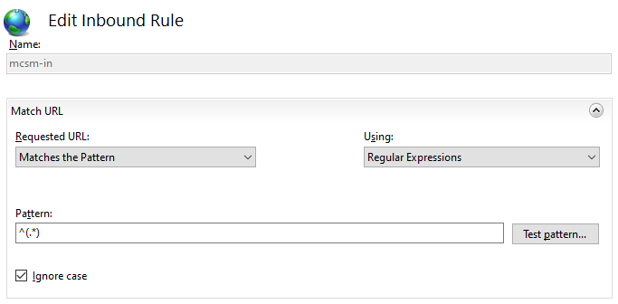
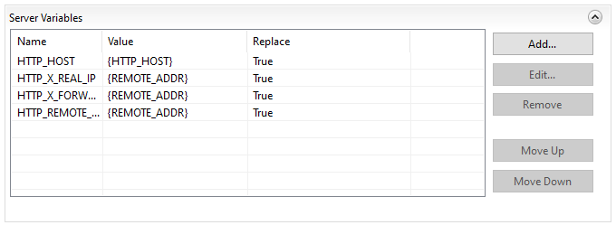
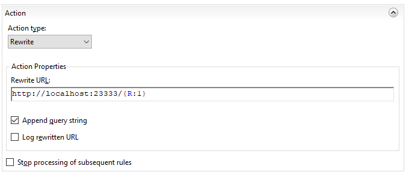

# Reverse Proxy for HTTPS with IIS

:::tip
**Make sure you FULLY understand the [Network Architecture](/ops/mcsm_network.md) before continue.**
:::

## Generate SSL Certificate

The following websites provide free 90-days SSL certificate for your domain. You can also choose other providers.

> [https://zerossl.com/](https://zerossl.com/)

You can also choose to get a certificate from `Let's Encrypt`, `Other CA`, or `Self-Signed Certificate`. Note, that a self-signed certificate is not trusted by OS and browser by default, it has to be added to the certificate store manually.

```
#Generate a Self-Signed Certificate using OpenSSL
openssl req -x509 -newkey rsa:4096 -keyout key.pem -out cert.pem -sha256 -days 365
```

## Convert SSL Certificate/Prepare the Certificate Chain

**Prepare the following files**:

1. Issued certificate, e.g. **_domain.crt_**。
2. Certificate of CA, can be downloaded from their website. e.g. **_ca.crt_**.
3. Private key of issued certificate, e.g. **_domain.key_**。

We will use **_domain.crt_**, **_ca.crt_**, **_domain.key_** as examples in this tutorial.

Windows system certificate store cannot directly import PEM format files, so you need to convert them to PFX format:

```
openssl pkcs12 -export -out certificate.pfx -inkey domain.key -in domain.crt
```

Integrating the certificate chain is generally not necessary because the required certificate chain is usually already trusted by the trust list. If you need to integrate the certificate chain for some reason, use the following command:

```
openssl pkcs12 -export -out certificate.pfx -inkey domain.key -in domain.crt -certfile ca.crt
```

## Install IIS

### Windows Server

1. Open `Server Manager` and click `Manage` > `Add Role and Features`
2. Navigate to `Server Roles` and check `Web Server (IIS)`

3. Go to `Web Server Role (IIS)`/`Role Services`
4. Add the following features

    - Common HTTP Features
      - HTTP Redirection
    - Application Development
      - CGI
      - ISAPI Extensions
      - ISAPI Filters
      - Server Side Includes
      - WebSocket Protocol
5. Go to `Confirmation` and `Install`

### Windows for Consumers

Press `Win+R`, type in `optionalfeatures` and press Enter.

Refer to the above Windows Server tutorial to add `Internet Information Services` and corresponding additional features in `World Wide Web Services`.

## Install prerequisite plugins

### [Application Request Routing](https://www.iis.net/downloads/microsoft/application-request-routing)
[32-bit](https://go.microsoft.com/fwlink/?LinkID=615135) / [64-bit](https://go.microsoft.com/fwlink/?LinkID=615136)

### [URL Rewrite](https://www.iis.net/downloads/microsoft/url-rewrite)
- **English:** [32-bit](https://download.microsoft.com/download/D/8/1/D81E5DD6-1ABB-46B0-9B4B-21894E18B77F/rewrite_x86_en-US.msi) / [64-bit](https://download.microsoft.com/download/1/2/8/128E2E22-C1B9-44A4-BE2A-5859ED1D4592/rewrite_amd64_en-US.msi)
- **German:** [32-bit](https://download.microsoft.com/download/D/8/1/D81E5DD6-1ABB-46B0-9B4B-21894E18B77F/rewrite_x86_de-DE.msi) / [64-bit](https://download.microsoft.com/download/1/2/8/128E2E22-C1B9-44A4-BE2A-5859ED1D4592/rewrite_amd64_de-DE.msi)
- **Spanish:** [32-bit](https://download.microsoft.com/download/D/8/1/D81E5DD6-1ABB-46B0-9B4B-21894E18B77F/rewrite_x86_es-ES.msi) / [64-bit](https://download.microsoft.com/download/1/2/8/128E2E22-C1B9-44A4-BE2A-5859ED1D4592/rewrite_amd64_es-ES.msi)
- **French:** [32-bit](https://download.microsoft.com/download/D/8/1/D81E5DD6-1ABB-46B0-9B4B-21894E18B77F/rewrite_x86_fr-FR.msi) / [64-bit](https://download.microsoft.com/download/1/2/8/128E2E22-C1B9-44A4-BE2A-5859ED1D4592/rewrite_amd64_fr-FR.msi)
- **Italian:** [32-bit](https://download.microsoft.com/download/D/8/1/D81E5DD6-1ABB-46B0-9B4B-21894E18B77F/rewrite_x86_it-IT.msi) / [64-bit](https://download.microsoft.com/download/1/2/8/128E2E22-C1B9-44A4-BE2A-5859ED1D4592/rewrite_amd64_it-IT.msi)
- **Japanese:** [32-bit](https://download.microsoft.com/download/D/8/1/D81E5DD6-1ABB-46B0-9B4B-21894E18B77F/rewrite_x86_ja-JP.msi) / [64-bit](https://download.microsoft.com/download/1/2/8/128E2E22-C1B9-44A4-BE2A-5859ED1D4592/rewrite_amd64_ja-JP.msi)
- **Korean:** [32-bit](https://download.microsoft.com/download/D/8/1/D81E5DD6-1ABB-46B0-9B4B-21894E18B77F/rewrite_x86_ko-KR.msi) / [64-bit](https://download.microsoft.com/download/1/2/8/128E2E22-C1B9-44A4-BE2A-5859ED1D4592/rewrite_amd64_ko-KR.msi)
- **Russian:** [32-bit](https://download.microsoft.com/download/D/8/1/D81E5DD6-1ABB-46B0-9B4B-21894E18B77F/rewrite_x86_ru-RU.msi) / [64-bit](https://download.microsoft.com/download/1/2/8/128E2E22-C1B9-44A4-BE2A-5859ED1D4592/rewrite_amd64_ru-RU.msi)
- **Chinese Simplified:** [32-bit](https://download.microsoft.com/download/D/8/1/D81E5DD6-1ABB-46B0-9B4B-21894E18B77F/rewrite_x86_zh-CN.msi) / [64-bit](https://download.microsoft.com/download/1/2/8/128E2E22-C1B9-44A4-BE2A-5859ED1D4592/rewrite_amd64_zh-CN.msi)
- **Chinese Traditional:** [32-bit](https://download.microsoft.com/download/D/8/1/D81E5DD6-1ABB-46B0-9B4B-21894E18B77F/rewrite_x86_zh-TW.msi) / [64-bit](https://download.microsoft.com/download/1/2/8/128E2E22-C1B9-44A4-BE2A-5859ED1D4592/rewrite_amd64_zh-TW.msi)

After installation, restart IIS service or reboot the computer.

## Install Certificate

1. Navigate to IIS local machine configuration and enter `Server Certificates`

2. Click `Import` on the right panel

3. Select the file and enter the password according to the certificate provider's instructions. If the certificate is converted via OpenSSL, there is no password.
4. Click `OK` to complete

## Configure site(s)

:::tip
Please configure 2 sites if for both Web and Daemon
:::

Add a website, create and select an empty directory. Then configure an HTTPS binding for the corresponding port and host name. When binding, check `Require Server Name Indication` if you use domain and necessary.

Please open the port in the firewall settings. To ensure system security, disabling the firewall is not recommended!

## Configure reverse proxy & variables

### Local Machine
1. Navigate to the IIS local machine configuration and go to `Application Request Routing Cache`

2. Click `Server Proxy Settings` in the right column
3. Check `Enable Proxy` and click `Apply` in the right column

### Site(s)

:::tip
Please use different directories as IIS saves config to `web.config`.
:::

1. Go to `URL Rewrite` of the site

2. Add the following variables to allow list
    - HTTP_HOST
    - HTTP_REMOTE_HOST
    - HTTP_X_FORWARDED_FOR
    - HTTP_X_REAL_IP
3. Click `Back to Rules`
4. Add a blank inbound rule
5. Name the rule as you like
6. Set pattern to `^(.*)`, and make sure the above option is `Matches the Pattern` / `Regular Expressions` and `Ignore case` checked

7. 按照如下表格设置服务器变量

If you are using Cloudflare proxy, set `HTTP_X_REAL_IP` to `{HTTP_CF_Connecting_IP}`.


| Name | Value | Replace |
|----------------------|----------------|-------|
| HTTP_HOST | `{HTTP_HOST}` | True |
| HTTP_X_REAL_IP | `{REMOTE_ADDR}` | True |
| HTTP_X_FORWARDED_FOR | `{REMOTE_ADDR}` | True |
| HTTP_REMOTE_HOST | `{REMOTE_ADDR}` | True |

8. Configure Action

    - Action type: `Rewrite`
    - Rewrite URL: `http://address:port/{R:1}`
    - Check `Append query string`
    - Uncheck `Log rewritten URL`
    - Uncheck `Stop processing of subsequent rules`
    
9. Click `Apply` on the right panel

## Verify Configuration

Once the configuration is ready, you can test the configuration by accessing the dashboard and/or nodes through the reverse proxy.

Suppose the domain being used is **_domain.com_** , and the HTTPS port is `12333` (for daemon) and `12444` (for panel), we can then access the following URL using any browser:

```txt
Panel: https://domain.com:12333/
Daemon: https://domain.com:12444/
```

For the daemon, if the following content is displayed, the HTTPS reverse proxy is successfully configured!

> [MCSManager Daemon] Status: OK | reference: https://mcsmanager.com/

For the web, if the login page is displayed correctly, the HTTPS reverse proxy is successfully configured!

## Connect via HTTPS

At this point, if you acess the web panel, you'll find that you can log in without problem.

**However**

If you enter any instance console to upload or download files, etc., you will find that it **still doesn't work** properly. This is because MCSManager requires the browser to connect **directly** to remote daemon. Since you've upgraded to HTTPS, the browser **refuses** to use the Websocket+HTTP protocol to connect to remote daemon!

> [Why does the browser need to connect directly to the remote daemons?](mcsm_network)

Go to the `Daemons` tab, you might find connections to remote daemons using `localhost`, `123.x.x.x`, or other domains. A reverse proxy for each remote daemon **_must be configured separately_**, so that they all use HTTPS to connect.

Once configured, replace the original `localhost`, `123.x.x.x`, or `domain.com` with `wss://localhost`, `wss://123.x.x.x`, or `wss://domain.com` respectively.