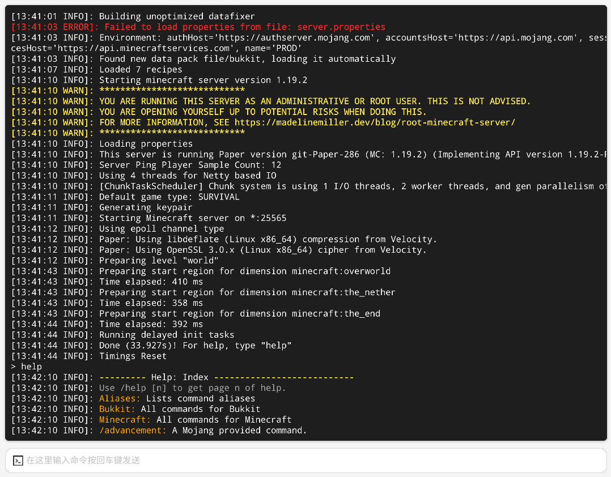

# Dependencies

## Install Java Environment

Before running the Minecraft Java Edition server, it is necessary to install the right Java Runtime Environment (JRE). If you are unsure about which Java version to use, take a look at the following table:

| JRE Version     |                         Minecraft Version                          |
| --------------- | :---------------------------------------------------------: |
| Java8           | 1.7.x，1.8.x，1.9.x，1.10.x，1.12.x，1.13.x，1.15.x，1.16.x |
| Java16 & Java17 |                           1.17.x                            |
| Java17          |                           1.18.x                            |
| Java17 or above |                  1.18.x & 1.19.x & 1.20.x                   |

:::tip
Avoid using JRE version 20 as it may cause errors.

Some plugins have their own Java requriements. If you are unsure, check with the plugin developer for supported JRE version(s).
:::

### For Windows

- [(Oracle) Java JDK 8](https://www.oracle.com/java/technologies/javase/jdk11-archive-downloads.html)
- [(Oracle) Java JDK 11](https://www.oracle.com/java/technologies/javase/javase8-archive-downloads.html)
- [(Oracle) Java JDK 17](https://download.oracle.com/java/17/latest/jdk-17_windows-x64_bin.exe)

> JRE 16 and above only support x86_64/amd64 systems.

## Setup with pre-build packages

:::tip
Please ensure that you have installed the correct version of JRE. You can check it by using the command `java -version`.
:::

1. Go to the Instance page and click the `Create` button to create a new instance.
2. Select `Minecraft Server (Java)`.
3. Select the machine (node) where you would like to deploy the server.
4. Select one pre-build package, and click `install`. Then provide any required data.
5. Wait for installation, and then go to `Instance terminal`.
6. Click `start` button on the top-right.

If you see something like this, the server should have started successfully.

