# MCSM 9 手动安装&反向代理&证书SSL-Linux系统（基于宝塔面板）

[TOC]

**作者**：[Shuazi233](https://github.com/Shuazijun)

#### 一、需要准备的环境&软件工具

##### 1.物理机 / VPS / 腾讯&阿里系云服务器

基础：前端服务器1台、后端服务器1台，系统推荐Centos7。

服务器都需要安装宝塔面板来实现后续的操作。以上为模拟多节点分布式部署情况，单机部署参考教程即可。

*宝塔Linux面板官方地址(请安装完成后进入宝塔后台,云服务器请自行查阅如何放行安全组)*

**Centos系统对应安装链接**

https://github.com/aaPanel/BaoTa#centos

或

https://www.bt.cn/bbs/thread-19376-1-1.html

##### 2.MCSM 9 本体

WEB与前端所在地址

https://github.com/MCSManager/MCSManager-Web-Production

Daemon后端所在地址

https://github.com/MCSManager/MCSManager-Daemon-Production

#### 二、宝塔面板初步配置

##### 1.初始环境的选择

初次进入宝塔面板，需要阅读并同意使用协议，这里我们略过。接下来网页会弹出让你选择安装基本环境，这里我们选择 **LNMP**

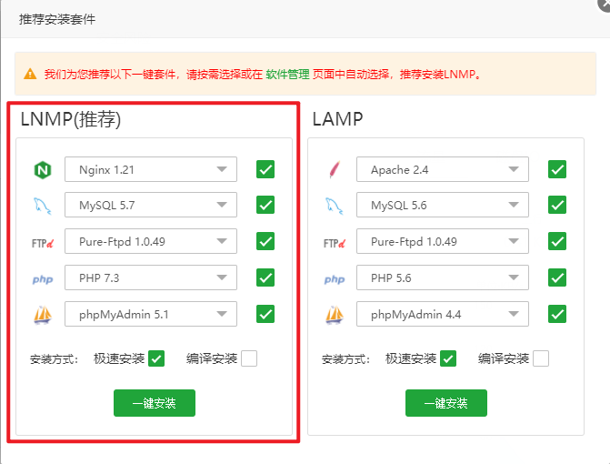  

注意：反向代理依赖于 **Nginx** ，首次安装务必选择 **LNMP**，**前端WEB与后端Daemon都得选LNMP安装！！！**

如果不需要数据库、FTP、PHP以及数据库管理软件的，可以只安装 **Nginx**

##### 2.插件的选择与配置

上一步完成基础的环境安装后，我们可以点击位于网页左侧的 **软件商店** 来进行必要的插件安装

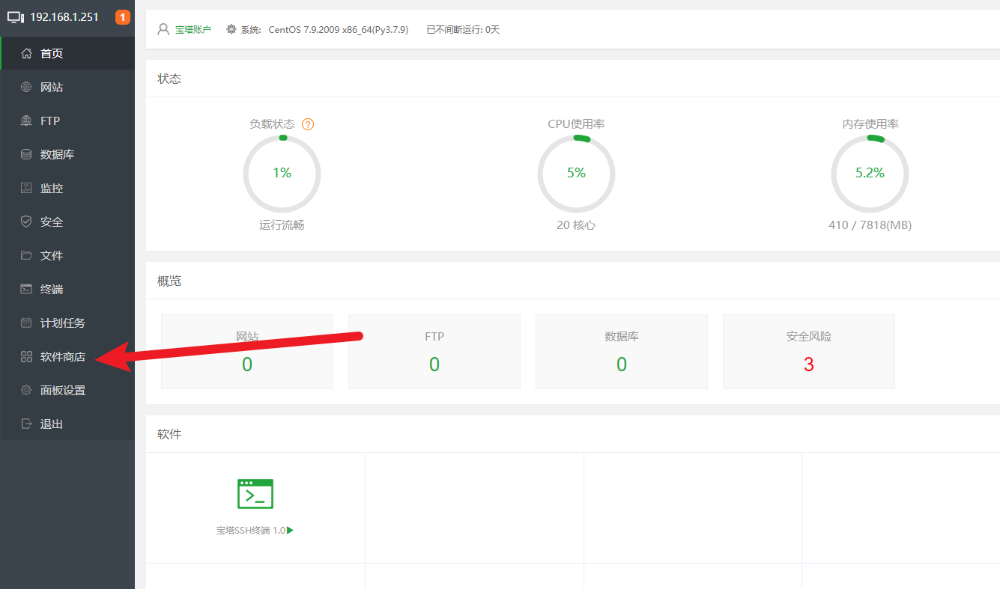  

**这里我们选择应用搜索，在输入框内输入 “pm2” 进行搜索**

  

****

**这里我们选择第二个 “PM2管理器” 进行安装，后端同理也需要安装。该插件主要用于管理Node版本和MCSM程序的状态监控与自启** *等待安装完成*

插件安装完成后，我们需要对其进行Node版本的切换，插件默认安装后的版本为 `[v16.13.1]` 我们需要将其版本切换至 `[v14.18.2]` 

  

**切换可能需要等待几分钟，完成会有提示，同理后端安装"PM2管理器"并进行版本切换。**

  

**以上，基本的插件已经配置完成，接下来我们需要对MCSM进行部署了。**

#### 三、MCSM项目的部署

##### 1.WEB与前端&Daemon后端文件下载

首先我们找到之前提到的 WEB与前端&Daemon后端 的存储仓库（[点我跳转[WEB与前端]](https://github.com/MCSManager/MCSManager-Web-Production)）（[点我跳转[Daemon后端]](https://github.com/MCSManager/MCSManager-Daemon-Production)）

我们打开左侧的  按钮，跳转到文件管理界面

  

这里我们点击 按钮，首次登录需要手动输入我们设置的**root账户的密码**

 

在输入正确的情况下，终端会自动登录并进入到当前目录

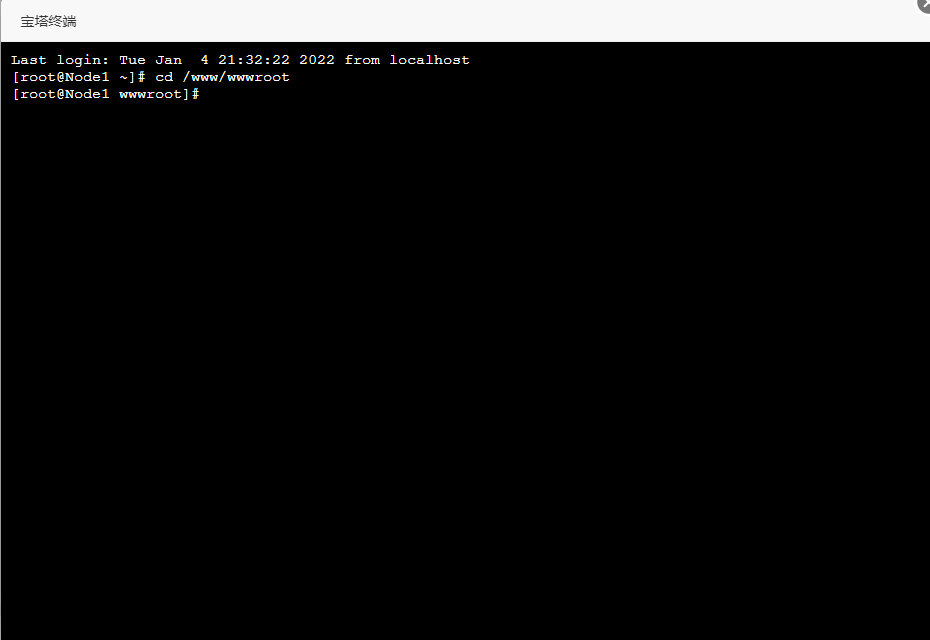 

如图，这是正常登录显示的界面。在这里，我们鼠标右键黏贴以下内容并回车

*这段的作用是克隆           WEB与前端的仓库          到本地*

```shell
git clone https://github.com/MCSManager/MCSManager-Web-Production.git
```

无异常的情况下，终端会反馈完成 `done`（如图）

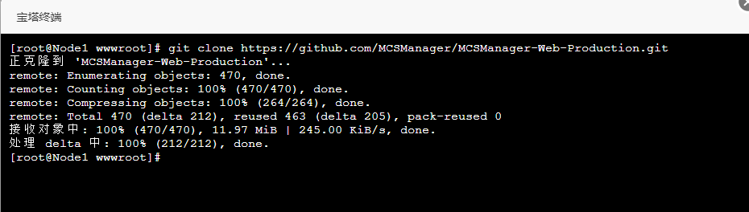 

此时，我们关闭终端，并刷新网页，我们会看到前端与WEB的库已经下载进服务器了

 

**同样，我们的后端服务器也需要执行以上的步骤，下载后端到对应服务器，以下为后端服务器的克隆指令**

```shell
git clone https://github.com/MCSManager/MCSManager-Daemon-Production.git
```

**以上为前后端的文件准备，接下来我们进行前后端的依赖安装**

##### 2.依赖安装

其实，前后端的依赖安装非常简单。这里我们点击进入项目文件夹，在文件夹内再次打开 **终端**

 

**打开终端后，需要输入以下指令进行依赖的安装，安装速度取决于你的服务器网络连通率以及下载网速**

```shell
npm install
```

**如图，显示该进度条时，证明依赖正在安装，请耐心等待**

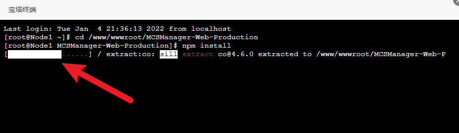 

**安装完成后如下图，这里我们注意到有黄色的 WARN 警告，正常情况下，可以无视**

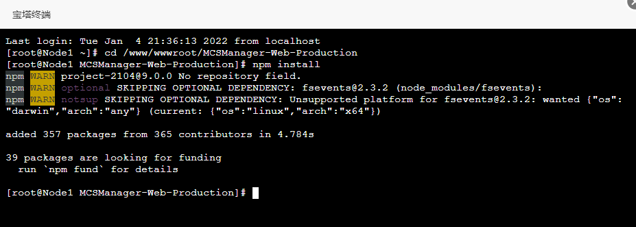 

**Daemon后端同样如此，进入项目文件夹后打开终端输入**

```shell
npm install
```

**依赖安装完成如图所示**

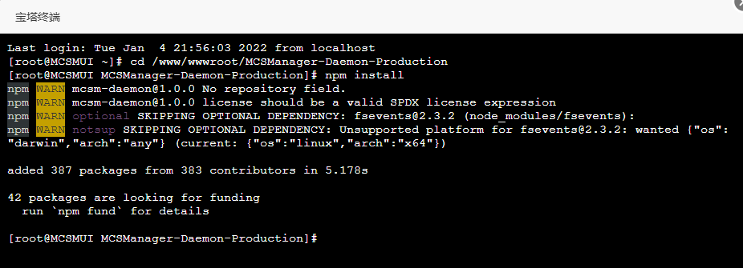 

**以上，MCSM的依赖安装已经完成，下一步，我们进行程序的启动**

##### 3.通过 PM2管理器 添加启动项目

在完成前面的准备工作后，我们需要打开 "PM2管理器" 进行项目的添加，请看图

首先，我们打开 PM2管理器，点击，在弹出界面我们点击选择 “启动文件”  

 

**如图，找到 "app.js" 后点击选择即可**

 

**后续的内容会自动填入，这里注意，我们需要手动将 运行用户 从 www 修改为 root **

 

**以上操作完成后，点击提交，项目会自动启动（如图）** 

**到这里，我们的前端已经启动成功了，Daemon后端的操作同上，开启成功后如下图**

 

**以上，我们完成了MCSM前后端的部署与启动，通过PM2管理器添加的项目每次开机都能实现自启。接下来我们进行反向代理以及证书的部署**。

#### 四、反向代理及SSL证书

##### 1.使用PM2管理器进行网站"映射"

如图，打开PM2管理器，找到“映射”并点击，域名输入完成后，请点击提交进行保存，系统会自动建立反代站点。

 

以上步骤完成后，**网站** 目录底线会出现对应的站点

 

**至此，网站的 "映射" 已完成。Daemon后端操作同上，但请注意，如果后端与前端不在同一台机器上时，请确保使用不同的域名或子域名。**

##### 2.反向代理的进一步♂配置

首先，我们找到刚刚 “映射” 好的网站，点击域名打开配置菜单。

  

这里我们找到 “反向代理” 点击进入，接着点击 “编辑”

 

**这里我们修改箭头所指的 "127.0.0.1" 为 "$host" 后保存。该步骤为确保反代能回传真实的访问IP到MCSM。**

 

**接着，需要点击 “配置文件” 按钮，修改反代参数，实现websocket的代理。如图并附上代码，插入位置参考图片。**

```nginx
proxy_set_header Upgrade $http_upgrade;
proxy_set_header Connection "upgrade";
```

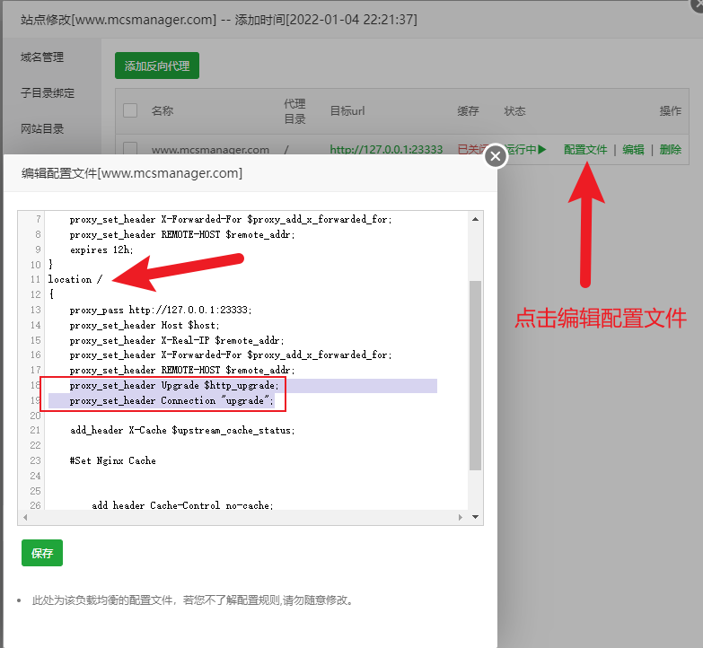 

**以上为，反向代理的基础参数修改，Daemon后端的反向代理也需要按此编辑添加一遍参数，不然可能导致连接后端失败。**

##### 3.网站配置及SSL证书

**完成上面的反向代理配置后，我们来对网站的端口和SSL证书进行配置**

**这里呢，我推荐使用**

`阿里云域名` 以及 `宝塔SSL选项` 中的 `Let's Encrypt` 如图，使用阿里的域名DNS进行快捷校验来获取证书

*当然，你选择其他证书或者手动导入都是可以的*

 

初次选择 `阿里云DNS` 会要求填写  `AccessKey` 和 `SecretKey` 具体获取方式请自行百度。

 

**如果你填写的内容没有错误的话，证书会在在校验成功后自动部署到该反代站点，后端同理。**

接下来，我们需要对网站进行参数配置，默认开启SSL证书后，宝塔会将`https`开放到`443`端口，对于部分未备案的服务器或者家宽用户，可能需要切换到别的端口使用。

**点击 “配置文件” 在第四行找到数字 443 ，把这个修改成你想要的端口，随后在宝塔面板左侧的 “安全” 按钮中放行端口后就能访问了（云服务器安全组也需要放行）**

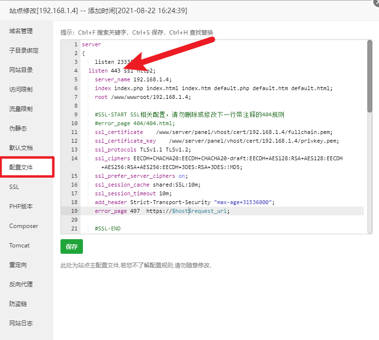 

**进阶知识：为了方便在你访问这个自定义https端口的时候不会被系统自动跳转到443端口，我们可以使用302重定向来进行自动跳转，这里我们用到 “配置文件” 中的 "error_page 497" 来进行简单重定向，附代码示例**

```nginx
#默认的参数
error_page 497  https://$host$request_uri;
#修改后
error_page 497  https://$host:自定义端口号参考第四行$request_uri;
```

**示例图**

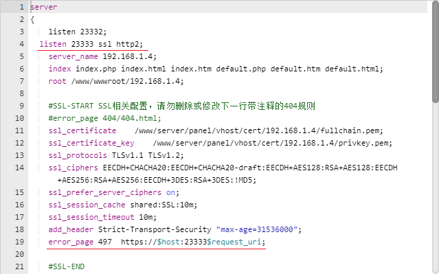 

**展示效果**

默认输入地址

 

自动跳转

 

**如果不使用 “error_page 497” 重定向规则的话**

 

**以上，前端的反向代理配置已经完成，后端也需要同样的操作进行反代配置，配置完成后，我们进行最后一步操作，前端链接至后端。**

#### 五、反代后的前后端链接

##### 1.以域名链接到后端

**如图，按照前面的步骤操作配置后，现在正常访问Daemon后端页面会得到以下的页面提示**

 

**如图所示，后端反代就算是完成了。**

**回到MCSM面板，登录 root 账户后（初始密码123456），点击 “分布式服务” 按钮进入到Daemon后端添加界面，接着点击**

**在弹出界面中，我们手动填入相关的信息，这里需要注意到的是，如果你想要做到全站HTTPS并且后端链接正常，你需要在下图红框位置填入后端的域名信息，我们需要手动在域名前添加前缀**

`wss://`

**示例地址**

```http
wss://node1.mcsmanager.com
```

 

**信息填写正确后即可点击 “新增” 按钮**

**若上面所有步骤包括（反代，参数配置，证书应用，端口修改）一切正常的情况下，节点添加完成后刷新页面，就会看到后端已经链接成功了**

 

##### 2.测试前后端连通性

**完成之前的所有操作后，我们需要对连通性做一定的测试，具体步骤如下**

###### 2.1、在 “应用实例” 中选择该节点进行 新增实例

在上传服务器软件时，上传成功，即为测试成功。

 

###### 2.2、进一步测试

点击进入到刚刚新建成功的实例中，如图。如果链接正常，实例操作终端会正常显示。反之，如果之前的反代配置有误或网络不佳，则可能会导致终端一直载入转圈或间接性丢失链接。（如图为正常状态）

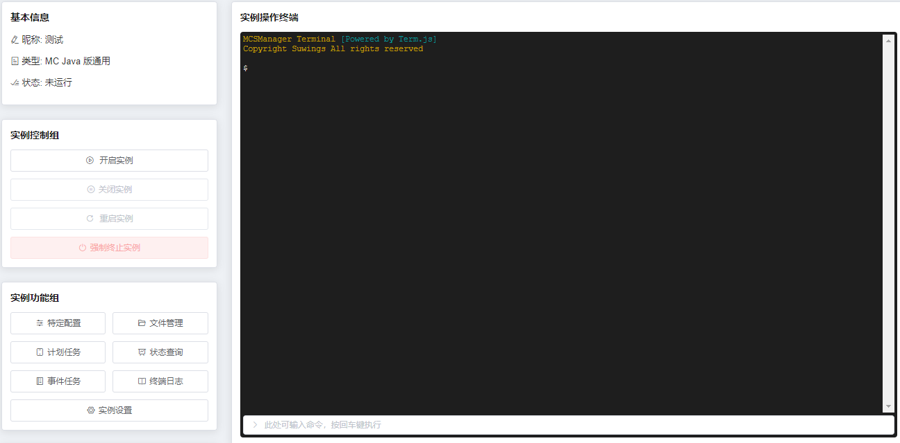 

###### 2.3、测试实例的文件上传、下载、删除

点击实例界面的 “文件管理” 按钮，在弹出界面进行文件的上传下载测试。若配置正常，文件上传下载也会正常执行（如图）

 

###### 2.4、测试服务器能否正常启动

这里我们以 MC JAVA版本 为例，首先，我们需要对新搭建的后端进行java环境的安装。就 `1.18.1` 版本来说，我们需要安装 `java17`。以下为安装命令

```sh
#显示所有能直接安装的 JAVA 版本,以Centos7为例
#在后端节点的终端终输入
yum list java*
```

正常情况下回获得以下反馈（网络通畅）

```sh
[root@MCSMUI ~]# yum list java*
已加载插件：fastestmirror
Loading mirror speeds from cached hostfile
 * base: centos.nethub.com.hk
 * epel: hk.mirrors.thegigabit.com
 * extras: centos.nethub.com.hk
 * updates: centos.nethub.com.hk
可安装的软件包
java-1.6.0-openjdk.x86_64                                                       1:1.6.0.41-1.13.13.1.el7_3                                  base   
java-1.6.0-openjdk-demo.x86_64                                                  1:1.6.0.41-1.13.13.1.el7_3                                  base   
java-1.6.0-openjdk-devel.x86_64                                                 1:1.6.0.41-1.13.13.1.el7_3                                  base   
java-1.6.0-openjdk-javadoc.x86_64                                               1:1.6.0.41-1.13.13.1.el7_3                                  base   
java-1.6.0-openjdk-src.x86_64                                                   1:1.6.0.41-1.13.13.1.el7_3                                  base   
java-1.7.0-openjdk.x86_64                                                       1:1.7.0.261-2.6.22.2.el7_8                                  base   
java-1.7.0-openjdk-accessibility.x86_64                                         1:1.7.0.261-2.6.22.2.el7_8                                  base   
java-1.7.0-openjdk-demo.x86_64                                                  1:1.7.0.261-2.6.22.2.el7_8                                  base   
java-1.7.0-openjdk-devel.x86_64                                                 1:1.7.0.261-2.6.22.2.el7_8                                  base   
java-1.7.0-openjdk-headless.x86_64                                              1:1.7.0.261-2.6.22.2.el7_8                                  base   
java-1.7.0-openjdk-javadoc.noarch                                               1:1.7.0.261-2.6.22.2.el7_8                                  base   
java-1.7.0-openjdk-src.x86_64                                                   1:1.7.0.261-2.6.22.2.el7_8                                  base   
java-1.8.0-openjdk.i686                                                         1:1.8.0.312.b07-1.el7_9                                     updates
java-1.8.0-openjdk.x86_64                                                       1:1.8.0.312.b07-1.el7_9                                     updates
java-1.8.0-openjdk-accessibility.i686                                           1:1.8.0.312.b07-1.el7_9                                     updates
java-1.8.0-openjdk-accessibility.x86_64                                         1:1.8.0.312.b07-1.el7_9                                     updates
java-1.8.0-openjdk-demo.i686                                                    1:1.8.0.312.b07-1.el7_9                                     updates
java-1.8.0-openjdk-demo.x86_64                                                  1:1.8.0.312.b07-1.el7_9                                     updates
java-1.8.0-openjdk-devel.i686                                                   1:1.8.0.312.b07-1.el7_9                                     updates
java-1.8.0-openjdk-devel.x86_64                                                 1:1.8.0.312.b07-1.el7_9                                     updates
java-1.8.0-openjdk-headless.i686                                                1:1.8.0.312.b07-1.el7_9                                     updates
java-1.8.0-openjdk-headless.x86_64                                              1:1.8.0.312.b07-1.el7_9                                     updates
java-1.8.0-openjdk-javadoc.noarch                                               1:1.8.0.312.b07-1.el7_9                                     updates
java-1.8.0-openjdk-javadoc-zip.noarch                                           1:1.8.0.312.b07-1.el7_9                                     updates
java-1.8.0-openjdk-src.i686                                                     1:1.8.0.312.b07-1.el7_9                                     updates
java-1.8.0-openjdk-src.x86_64                                                   1:1.8.0.312.b07-1.el7_9                                     updates
java-11-openjdk.i686                                                            1:11.0.13.0.8-1.el7_9                                       updates
java-11-openjdk.x86_64                                                          1:11.0.13.0.8-1.el7_9                                       updates
java-11-openjdk-demo.i686                                                       1:11.0.13.0.8-1.el7_9                                       updates
java-11-openjdk-demo.x86_64                                                     1:11.0.13.0.8-1.el7_9                                       updates
java-11-openjdk-devel.i686                                                      1:11.0.13.0.8-1.el7_9                                       updates
java-11-openjdk-devel.x86_64                                                    1:11.0.13.0.8-1.el7_9                                       updates
java-11-openjdk-headless.i686                                                   1:11.0.13.0.8-1.el7_9                                       updates
java-11-openjdk-headless.x86_64                                                 1:11.0.13.0.8-1.el7_9                                       updates
java-11-openjdk-javadoc.i686                                                    1:11.0.13.0.8-1.el7_9                                       updates
java-11-openjdk-javadoc.x86_64                                                  1:11.0.13.0.8-1.el7_9                                       updates
java-11-openjdk-javadoc-zip.i686                                                1:11.0.13.0.8-1.el7_9                                       updates
java-11-openjdk-javadoc-zip.x86_64                                              1:11.0.13.0.8-1.el7_9                                       updates
java-11-openjdk-jmods.i686                                                      1:11.0.13.0.8-1.el7_9                                       updates
java-11-openjdk-jmods.x86_64                                                    1:11.0.13.0.8-1.el7_9                                       updates
java-11-openjdk-src.i686                                                        1:11.0.13.0.8-1.el7_9                                       updates
java-11-openjdk-src.x86_64                                                      1:11.0.13.0.8-1.el7_9                                       updates
java-11-openjdk-static-libs.i686                                                1:11.0.13.0.8-1.el7_9                                       updates
java-11-openjdk-static-libs.x86_64                                              1:11.0.13.0.8-1.el7_9                                       updates
java-atk-wrapper.i686                                                           0.30.4-5.el7                                                base   
java-atk-wrapper.x86_64                                                         0.30.4-5.el7                                                base   
java-dirq.noarch                                                                1.8-1.el7                                                   epel   
java-dirq-javadoc.noarch                                                        1.8-1.el7                                                   epel   
java-latest-openjdk.x86_64                                                      1:17.0.1.0.12-1.rolling.el7                                 epel   
java-latest-openjdk-debug.x86_64                                                1:17.0.1.0.12-1.rolling.el7                                 epel   
java-latest-openjdk-demo.x86_64                                                 1:17.0.1.0.12-1.rolling.el7                                 epel   
java-latest-openjdk-demo-debug.x86_64                                           1:17.0.1.0.12-1.rolling.el7                                 epel   
java-latest-openjdk-demo-fastdebug.x86_64                                       1:17.0.1.0.12-1.rolling.el7                                 epel   
java-latest-openjdk-devel.x86_64                                                1:17.0.1.0.12-1.rolling.el7                                 epel   
java-latest-openjdk-devel-debug.x86_64                                          1:17.0.1.0.12-1.rolling.el7                                 epel   
java-latest-openjdk-devel-fastdebug.x86_64                                      1:17.0.1.0.12-1.rolling.el7                                 epel   
java-latest-openjdk-fastdebug.x86_64                                            1:17.0.1.0.12-1.rolling.el7                                 epel   
java-latest-openjdk-headless.x86_64                                             1:17.0.1.0.12-1.rolling.el7                                 epel   
java-latest-openjdk-headless-debug.x86_64                                       1:17.0.1.0.12-1.rolling.el7                                 epel   
java-latest-openjdk-headless-fastdebug.x86_64                                   1:17.0.1.0.12-1.rolling.el7                                 epel   
java-latest-openjdk-javadoc.x86_64                                              1:17.0.1.0.12-1.rolling.el7                                 epel   
java-latest-openjdk-javadoc-zip.x86_64                                          1:17.0.1.0.12-1.rolling.el7                                 epel   
java-latest-openjdk-jmods.x86_64                                                1:17.0.1.0.12-1.rolling.el7                                 epel   
java-latest-openjdk-jmods-debug.x86_64                                          1:17.0.1.0.12-1.rolling.el7                                 epel   
java-latest-openjdk-jmods-fastdebug.x86_64                                      1:17.0.1.0.12-1.rolling.el7                                 epel   
java-latest-openjdk-src.x86_64                                                  1:17.0.1.0.12-1.rolling.el7                                 epel   
java-latest-openjdk-src-debug.x86_64                                            1:17.0.1.0.12-1.rolling.el7                                 epel   
java-latest-openjdk-src-fastdebug.x86_64                                        1:17.0.1.0.12-1.rolling.el7                                 epel   
java-latest-openjdk-static-libs.x86_64                                          1:17.0.1.0.12-1.rolling.el7                                 epel   
java-latest-openjdk-static-libs-debug.x86_64                                    1:17.0.1.0.12-1.rolling.el7                                 epel   
java-latest-openjdk-static-libs-fastdebug.x86_64                                1:17.0.1.0.12-1.rolling.el7                                 epel   
java-oauth.noarch                                                               20100601-13.el7                                             epel   
java-oauth-javadoc.noarch                                                       20100601-13.el7                                             epel   
java-runtime-decompiler.noarch                                                  5.1-1.el7                                                   epel   
java-runtime-decompiler-javadoc.noarch                                          5.1-1.el7                                                   epel   
java_cup.noarch                                                                 1:0.11a-16.el7                                              base   
java_cup-javadoc.noarch                                                         1:0.11a-16.el7                                              base   
java_cup-manual.noarch                                                          1:0.11a-16.el7                                              base   
javacc.noarch                                                                   5.0-10.el7                                                  base   
javacc-demo.noarch                                                              5.0-10.el7                                                  base   
javacc-javadoc.noarch                                                           5.0-10.el7                                                  base   
javacc-manual.noarch                                                            5.0-10.el7                                                  base   
javacc-maven-plugin.noarch                                                      2.6-17.el7                                                  base   
javacc-maven-plugin-javadoc.noarch                                              2.6-17.el7                                                  base   
javamail.noarch                                                                 1.4.6-8.el7                                                 base   
javamail-javadoc.noarch                                                         1.4.6-8.el7                                                 base   
javapackages-tools.noarch                                                       3.4.1-11.el7                                                base   
javaparser.noarch                                                               1.0.11-3.el7                                                epel   
javaparser-javadoc.noarch                                                       1.0.11-3.el7                                                epel   
javassist.noarch                                                                3.16.1-10.el7                                               base   
javassist-javadoc.noarch                                                        3.16.1-10.el7                                               base   
javastroke.x86_64                                                               0.5.1-33.el7                                                epel   
javawriter.noarch                                                               2.5.1-4.el7                                                 epel   
javawriter-javadoc.noarch                                                       2.5.1-4.el7                                                 epel   
[root@MCSMUI ~]# 
```

这里我们看到 Java 17 的包名为 `java-latest-openjdk`，所以我们可以输入以下指令来进行安装（latest版本不一定java17，请自行判断）

```sh
yum install -y java-latest-openjdk
```

安装完成户或者以下提示

```sh
[root@MCSMUI ~]# yum install -y java-latest-openjdk
已加载插件：fastestmirror
Loading mirror speeds from cached hostfile
epel/x86_64/metalink                                                                                                        | 9.0 kB  00:00:00     
 * base: centos.nethub.com.hk
 * epel: mirror.yer.az
 * extras: centos.nethub.com.hk
 * updates: centos.nethub.com.hk
base                                                                                                                        | 3.6 kB  00:00:00     
extras                                                                                                                      | 2.9 kB  00:00:00     
updates                                                                                                                     | 2.9 kB  00:00:00     
updates/7/x86_64/primary_db                                                                                                 |  13 MB  00:00:01     
正在解决依赖关系
--> 正在检查事务
---> 软件包 java-latest-openjdk.x86_64.1.17.0.1.0.12-1.rolling.el7 将被 安装
--> 正在处理依赖关系 java-latest-openjdk-headless(x86-64) = 1:17.0.1.0.12-1.rolling.el7，它被软件包 1:java-latest-openjdk-17.0.1.0.12-1.rolling.el7.x86_64 需要
--> 正在处理依赖关系 libXcomposite(x86-64)，它被软件包 1:java-latest-openjdk-17.0.1.0.12-1.rolling.el7.x86_64 需要
--> 正在处理依赖关系 xorg-x11-fonts-Type1，它被软件包 1:java-latest-openjdk-17.0.1.0.12-1.rolling.el7.x86_64 需要
--> 正在处理依赖关系 libXi.so.6()(64bit)，它被软件包 1:java-latest-openjdk-17.0.1.0.12-1.rolling.el7.x86_64 需要
--> 正在处理依赖关系 libXtst.so.6()(64bit)，它被软件包 1:java-latest-openjdk-17.0.1.0.12-1.rolling.el7.x86_64 需要
--> 正在处理依赖关系 libgif.so.4()(64bit)，它被软件包 1:java-latest-openjdk-17.0.1.0.12-1.rolling.el7.x86_64 需要
--> 正在检查事务
---> 软件包 giflib.x86_64.0.4.1.6-9.el7 将被 安装
---> 软件包 java-latest-openjdk-headless.x86_64.1.17.0.1.0.12-1.rolling.el7 将被 安装
--> 正在处理依赖关系 copy-jdk-configs >= 3.3，它被软件包 1:java-latest-openjdk-headless-17.0.1.0.12-1.rolling.el7.x86_64 需要
--> 正在处理依赖关系 tzdata-java >= 2015d，它被软件包 1:java-latest-openjdk-headless-17.0.1.0.12-1.rolling.el7.x86_64 需要
--> 正在处理依赖关系 cups-libs，它被软件包 1:java-latest-openjdk-headless-17.0.1.0.12-1.rolling.el7.x86_64 需要
--> 正在处理依赖关系 javapackages-tools，它被软件包 1:java-latest-openjdk-headless-17.0.1.0.12-1.rolling.el7.x86_64 需要
--> 正在处理依赖关系 lksctp-tools(x86-64)，它被软件包 1:java-latest-openjdk-headless-17.0.1.0.12-1.rolling.el7.x86_64 需要
--> 正在处理依赖关系 pcsc-lite-libs(x86-64)，它被软件包 1:java-latest-openjdk-headless-17.0.1.0.12-1.rolling.el7.x86_64 需要
--> 正在处理依赖关系 libharfbuzz.so.0()(64bit)，它被软件包 1:java-latest-openjdk-headless-17.0.1.0.12-1.rolling.el7.x86_64 需要
---> 软件包 libXcomposite.x86_64.0.0.4.4-4.1.el7 将被 安装
---> 软件包 libXi.x86_64.0.1.7.9-1.el7 将被 安装
---> 软件包 libXtst.x86_64.0.1.2.3-1.el7 将被 安装
---> 软件包 xorg-x11-fonts-Type1.noarch.0.7.5-9.el7 将被 安装
--> 正在处理依赖关系 ttmkfdir，它被软件包 xorg-x11-fonts-Type1-7.5-9.el7.noarch 需要
--> 正在处理依赖关系 ttmkfdir，它被软件包 xorg-x11-fonts-Type1-7.5-9.el7.noarch 需要
--> 正在处理依赖关系 mkfontdir，它被软件包 xorg-x11-fonts-Type1-7.5-9.el7.noarch 需要
--> 正在处理依赖关系 mkfontdir，它被软件包 xorg-x11-fonts-Type1-7.5-9.el7.noarch 需要
--> 正在检查事务
---> 软件包 copy-jdk-configs.noarch.0.3.3-10.el7_5 将被 安装
---> 软件包 cups-libs.x86_64.1.1.6.3-51.el7 将被 安装
--> 正在处理依赖关系 libavahi-common.so.3()(64bit)，它被软件包 1:cups-libs-1.6.3-51.el7.x86_64 需要
--> 正在处理依赖关系 libavahi-client.so.3()(64bit)，它被软件包 1:cups-libs-1.6.3-51.el7.x86_64 需要
---> 软件包 harfbuzz.x86_64.0.1.7.5-2.el7 将被 安装
--> 正在处理依赖关系 libgraphite2.so.3()(64bit)，它被软件包 harfbuzz-1.7.5-2.el7.x86_64 需要
---> 软件包 javapackages-tools.noarch.0.3.4.1-11.el7 将被 安装
--> 正在处理依赖关系 python-javapackages = 3.4.1-11.el7，它被软件包 javapackages-tools-3.4.1-11.el7.noarch 需要
---> 软件包 lksctp-tools.x86_64.0.1.0.17-2.el7 将被 安装
---> 软件包 pcsc-lite-libs.x86_64.0.1.8.8-8.el7 将被 安装
---> 软件包 ttmkfdir.x86_64.0.3.0.9-42.el7 将被 安装
---> 软件包 tzdata-java.noarch.0.2021e-1.el7 将被 安装
---> 软件包 xorg-x11-font-utils.x86_64.1.7.5-21.el7 将被 安装
--> 正在处理依赖关系 libfontenc.so.1()(64bit)，它被软件包 1:xorg-x11-font-utils-7.5-21.el7.x86_64 需要
--> 正在检查事务
---> 软件包 avahi-libs.x86_64.0.0.6.31-20.el7 将被 安装
---> 软件包 graphite2.x86_64.0.1.3.10-1.el7_3 将被 安装
---> 软件包 libfontenc.x86_64.0.1.1.3-3.el7 将被 安装
---> 软件包 python-javapackages.noarch.0.3.4.1-11.el7 将被 安装
--> 正在处理依赖关系 python-lxml，它被软件包 python-javapackages-3.4.1-11.el7.noarch 需要
--> 正在检查事务
---> 软件包 python-lxml.x86_64.0.3.2.1-4.el7 将被 安装
--> 解决依赖关系完成

依赖关系解决

===================================================================================================================================================
 Package                                       架构                    版本                                         源                        大小
===================================================================================================================================================
正在安装:
 java-latest-openjdk                           x86_64                  1:17.0.1.0.12-1.rolling.el7                  epel                     210 k
为依赖而安装:
 avahi-libs                                    x86_64                  0.6.31-20.el7                                base                      62 k
 copy-jdk-configs                              noarch                  3.3-10.el7_5                                 base                      21 k
 cups-libs                                     x86_64                  1:1.6.3-51.el7                               base                     359 k
 giflib                                        x86_64                  4.1.6-9.el7                                  base                      40 k
 graphite2                                     x86_64                  1.3.10-1.el7_3                               base                     115 k
 harfbuzz                                      x86_64                  1.7.5-2.el7                                  base                     267 k
 java-latest-openjdk-headless                  x86_64                  1:17.0.1.0.12-1.rolling.el7                  epel                      40 M
 javapackages-tools                            noarch                  3.4.1-11.el7                                 base                      73 k
 libXcomposite                                 x86_64                  0.4.4-4.1.el7                                base                      22 k
 libXi                                         x86_64                  1.7.9-1.el7                                  base                      40 k
 libXtst                                       x86_64                  1.2.3-1.el7                                  base                      20 k
 libfontenc                                    x86_64                  1.1.3-3.el7                                  base                      31 k
 lksctp-tools                                  x86_64                  1.0.17-2.el7                                 base                      88 k
 pcsc-lite-libs                                x86_64                  1.8.8-8.el7                                  base                      34 k
 python-javapackages                           noarch                  3.4.1-11.el7                                 base                      31 k
 python-lxml                                   x86_64                  3.2.1-4.el7                                  base                     758 k
 ttmkfdir                                      x86_64                  3.0.9-42.el7                                 base                      48 k
 tzdata-java                                   noarch                  2021e-1.el7                                  updates                  190 k
 xorg-x11-font-utils                           x86_64                  1:7.5-21.el7                                 base                     104 k
 xorg-x11-fonts-Type1                          noarch                  7.5-9.el7                                    base                     521 k

事务概要
===================================================================================================================================================
安装  1 软件包 (+20 依赖软件包)

总下载量：43 M
安装大小：186 M
Downloading packages:
(1/21): copy-jdk-configs-3.3-10.el7_5.noarch.rpm                                                                            |  21 kB  00:00:00     
(2/21): avahi-libs-0.6.31-20.el7.x86_64.rpm                                                                                 |  62 kB  00:00:00     
(3/21): giflib-4.1.6-9.el7.x86_64.rpm                                                                                       |  40 kB  00:00:00     
(4/21): cups-libs-1.6.3-51.el7.x86_64.rpm                                                                                   | 359 kB  00:00:00     
(5/21): graphite2-1.3.10-1.el7_3.x86_64.rpm                                                                                 | 115 kB  00:00:00     
(6/21): harfbuzz-1.7.5-2.el7.x86_64.rpm                                                                                     | 267 kB  00:00:00     
(7/21): java-latest-openjdk-17.0.1.0.12-1.rolling.el7.x86_64.rpm                                                            | 210 kB  00:00:00     
(8/21): libXcomposite-0.4.4-4.1.el7.x86_64.rpm                                                                              |  22 kB  00:00:00     
(9/21): javapackages-tools-3.4.1-11.el7.noarch.rpm                                                                          |  73 kB  00:00:00     
(10/21): libXi-1.7.9-1.el7.x86_64.rpm                                                                                       |  40 kB  00:00:00     
(11/21): libXtst-1.2.3-1.el7.x86_64.rpm                                                                                     |  20 kB  00:00:00     
(12/21): libfontenc-1.1.3-3.el7.x86_64.rpm                                                                                  |  31 kB  00:00:00     
(13/21): lksctp-tools-1.0.17-2.el7.x86_64.rpm                                                                               |  88 kB  00:00:00     
(14/21): pcsc-lite-libs-1.8.8-8.el7.x86_64.rpm                                                                              |  34 kB  00:00:00     
(15/21): python-javapackages-3.4.1-11.el7.noarch.rpm                                                                        |  31 kB  00:00:00     
(16/21): ttmkfdir-3.0.9-42.el7.x86_64.rpm                                                                                   |  48 kB  00:00:00     
(17/21): python-lxml-3.2.1-4.el7.x86_64.rpm                                                                                 | 758 kB  00:00:00     
(18/21): xorg-x11-font-utils-7.5-21.el7.x86_64.rpm                                                                          | 104 kB  00:00:00     
(19/21): xorg-x11-fonts-Type1-7.5-9.el7.noarch.rpm                                                                          | 521 kB  00:00:00     
(20/21): tzdata-java-2021e-1.el7.noarch.rpm                                                                                 | 190 kB  00:00:00     
(21/21): java-latest-openjdk-headless-17.0.1.0.12-1.rolling.el7.x86_64.rpm                                                  |  40 MB  00:00:03     
---------------------------------------------------------------------------------------------------------------------------------------------------
总计                                                                                                                11 MB/s |  43 MB  00:00:03     
Running transaction check
Running transaction test
Transaction test succeeded
Running transaction
警告：RPM 数据库已被非 yum 程序修改。
  正在安装    : libXi-1.7.9-1.el7.x86_64                                                                                                      1/21 
  正在安装    : libXtst-1.2.3-1.el7.x86_64                                                                                                    2/21 
  正在安装    : avahi-libs-0.6.31-20.el7.x86_64                                                                                               3/21 
  正在安装    : 1:cups-libs-1.6.3-51.el7.x86_64                                                                                               4/21 
  正在安装    : copy-jdk-configs-3.3-10.el7_5.noarch                                                                                          5/21 
  正在安装    : lksctp-tools-1.0.17-2.el7.x86_64                                                                                              6/21 
  正在安装    : libfontenc-1.1.3-3.el7.x86_64                                                                                                 7/21 
  正在安装    : 1:xorg-x11-font-utils-7.5-21.el7.x86_64                                                                                       8/21 
  正在安装    : tzdata-java-2021e-1.el7.noarch                                                                                                9/21 
  正在安装    : pcsc-lite-libs-1.8.8-8.el7.x86_64                                                                                            10/21 
  正在安装    : python-lxml-3.2.1-4.el7.x86_64                                                                                               11/21 
  正在安装    : python-javapackages-3.4.1-11.el7.noarch                                                                                      12/21 
  正在安装    : javapackages-tools-3.4.1-11.el7.noarch                                                                                       13/21 
  正在安装    : libXcomposite-0.4.4-4.1.el7.x86_64                                                                                           14/21 
  正在安装    : ttmkfdir-3.0.9-42.el7.x86_64                                                                                                 15/21 
  正在安装    : xorg-x11-fonts-Type1-7.5-9.el7.noarch                                                                                        16/21 
  正在安装    : giflib-4.1.6-9.el7.x86_64                                                                                                    17/21 
  正在安装    : graphite2-1.3.10-1.el7_3.x86_64                                                                                              18/21 
  正在安装    : harfbuzz-1.7.5-2.el7.x86_64                                                                                                  19/21 
  正在安装    : 1:java-latest-openjdk-headless-17.0.1.0.12-1.rolling.el7.x86_64                                                              20/21 
  正在安装    : 1:java-latest-openjdk-17.0.1.0.12-1.rolling.el7.x86_64                                                                       21/21 
  验证中      : 1:cups-libs-1.6.3-51.el7.x86_64                                                                                               1/21 
  验证中      : libXi-1.7.9-1.el7.x86_64                                                                                                      2/21 
  验证中      : graphite2-1.3.10-1.el7_3.x86_64                                                                                               3/21 
  验证中      : 1:java-latest-openjdk-17.0.1.0.12-1.rolling.el7.x86_64                                                                        4/21 
  验证中      : giflib-4.1.6-9.el7.x86_64                                                                                                     5/21 
  验证中      : xorg-x11-fonts-Type1-7.5-9.el7.noarch                                                                                         6/21 
  验证中      : 1:java-latest-openjdk-headless-17.0.1.0.12-1.rolling.el7.x86_64                                                               7/21 
  验证中      : python-javapackages-3.4.1-11.el7.noarch                                                                                       8/21 
  验证中      : harfbuzz-1.7.5-2.el7.x86_64                                                                                                   9/21 
  验证中      : 1:xorg-x11-font-utils-7.5-21.el7.x86_64                                                                                      10/21 
  验证中      : ttmkfdir-3.0.9-42.el7.x86_64                                                                                                 11/21 
  验证中      : libXcomposite-0.4.4-4.1.el7.x86_64                                                                                           12/21 
  验证中      : python-lxml-3.2.1-4.el7.x86_64                                                                                               13/21 
  验证中      : libXtst-1.2.3-1.el7.x86_64                                                                                                   14/21 
  验证中      : pcsc-lite-libs-1.8.8-8.el7.x86_64                                                                                            15/21 
  验证中      : javapackages-tools-3.4.1-11.el7.noarch                                                                                       16/21 
  验证中      : tzdata-java-2021e-1.el7.noarch                                                                                               17/21 
  验证中      : libfontenc-1.1.3-3.el7.x86_64                                                                                                18/21 
  验证中      : lksctp-tools-1.0.17-2.el7.x86_64                                                                                             19/21 
  验证中      : copy-jdk-configs-3.3-10.el7_5.noarch                                                                                         20/21 
  验证中      : avahi-libs-0.6.31-20.el7.x86_64                                                                                              21/21 

已安装:
  java-latest-openjdk.x86_64 1:17.0.1.0.12-1.rolling.el7                                                                                           

作为依赖被安装:
  avahi-libs.x86_64 0:0.6.31-20.el7                                                   copy-jdk-configs.noarch 0:3.3-10.el7_5                      
  cups-libs.x86_64 1:1.6.3-51.el7                                                     giflib.x86_64 0:4.1.6-9.el7                                 
  graphite2.x86_64 0:1.3.10-1.el7_3                                                   harfbuzz.x86_64 0:1.7.5-2.el7                               
  java-latest-openjdk-headless.x86_64 1:17.0.1.0.12-1.rolling.el7                     javapackages-tools.noarch 0:3.4.1-11.el7                    
  libXcomposite.x86_64 0:0.4.4-4.1.el7                                                libXi.x86_64 0:1.7.9-1.el7                                  
  libXtst.x86_64 0:1.2.3-1.el7                                                        libfontenc.x86_64 0:1.1.3-3.el7                             
  lksctp-tools.x86_64 0:1.0.17-2.el7                                                  pcsc-lite-libs.x86_64 0:1.8.8-8.el7                         
  python-javapackages.noarch 0:3.4.1-11.el7                                           python-lxml.x86_64 0:3.2.1-4.el7                            
  ttmkfdir.x86_64 0:3.0.9-42.el7                                                      tzdata-java.noarch 0:2021e-1.el7                            
  xorg-x11-font-utils.x86_64 1:7.5-21.el7                                             xorg-x11-fonts-Type1.noarch 0:7.5-9.el7                     

完毕！
[root@MCSMUI ~]# 
```

**以上，JAVA 17版本已经安装完成，随后我们就可以进行开服测试了（如果需要不同JAVA版本，请安装多版本JAVA并在创建实例时手动链接到对应JAVA目录，推荐使用Docker手动构建JAVA环境，更安全更简单）**

**Daemon后端JAVA环境安装完成后，直接在实例控制界面点击** 

**所有配置正常情况下，开服成功（如图）**

 

###### 2.5、没了写完了待补充（2022/1/5）


