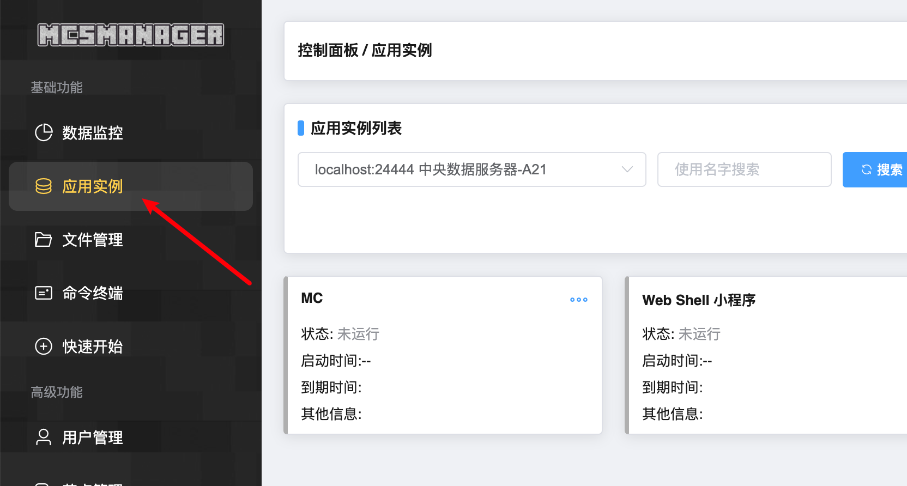

# 基础概念


### 应用实例

任何程序（EXE程序），游戏服务端（MC服务器）或脚本（Shell）都视作为一个 `应用实例` 由面板统一管理。

从简单的角度来说，**仅仅只是换一个称呼方式以便于适用更多的程序类型**。


功能所在地如图所示：




<br />

### 实例类型

因为我们的 `应用实例` 支持多种类型的程序，所以这里可以指定这个实例是什么类型，不同的选项会导致一些行为不一样，比如配置文件解析，命令执行方式等等。


<br />

### 守护进程

如果你在 Linux 下启动面板时，会启动两个`服务`，其中 `daemon` 就代表守护进程，它是一个类似于 `被控端` 的程序，由自带网页的控制中心来控制它们，从而实现多个物理主机互相连接。

```bash
# 这就是启动了守护进程（Linux）
systemctl start mcsm-daemon
```

所以守护进程就是类似于一个 `被控端` 的角色，你的 MC 服务器，EXE 程序都是在这个 `被控端` 上运行，而网页就是 `控制中心` 的角色。

下图表示了从网页上连接各个地方的 `守护进程`。

 
