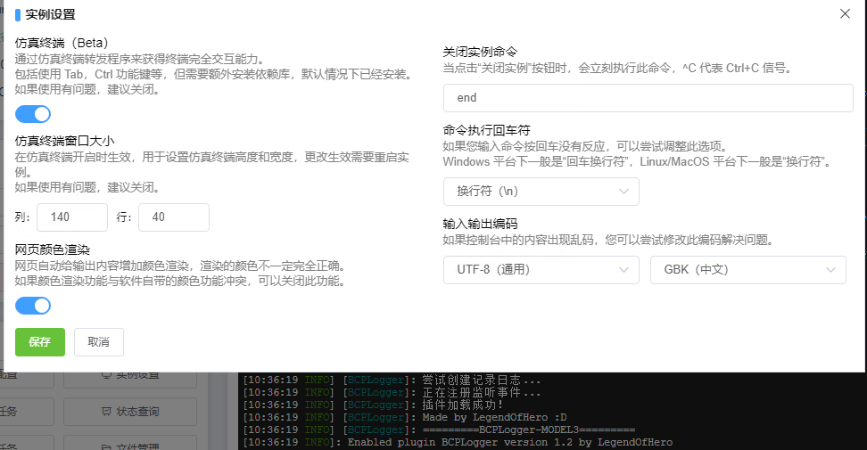

# 常见乱码解决方案

## 编码设置位置

应用实例 - 选择一个实例 - 终端 - 实例设置。

通过调整右下角的 “输入输出编码” 来尝试解决乱码问题，**因应用程序和系统环境复杂，建议进行多种不同编码尝试来解决问题**。

 

## Linux

一般选择 `UTF8` 作为统一编码，很少会出现乱码问题，如果在 Linux 上开启实例输出的文本依然是乱码，可以考虑调整你的应用程序或系统编码。

比如，如果是启动 Minecraft 服务器您可以在启动命令添加参数 `-Dfile.encoding=UTF-8` 来指定 Java 程序编码。

> java -Dfile.encoding=UTF-8 -jar Paper-1.8.8.jar

 

## Windows

在中国大陆地区，Windows 系统一般是 `GBK`或`GB2312` 编码。

在香港，台湾地区一般选择 BIG5 或其他。

**如果您启用了“仿真终端”选项**，可能要调整到 UTF8 才能解决乱码问题，具体情况需要具体分析，请您进行多次不同编码的尝试以解决问题，也可以选择关闭”仿真终端“选项来尝试。

如果是启动 Minecraft 服务器您可以在启动命令添加参数 `-Dfile.encoding=UTF-8` 来指定 Java 程序编码。

> "C:\Users\Administrator\Desktop\Mcsmoke\Java\jre-8\bin\java.exe" -Dfile.encoding=UTF-8 -jar Paper-1.8.8.jar

请注意. 对于1.14或更高版本的Java服务器 模拟终端(即非仿真终端)输入/输出编码应始终为您计算机的主要编码 即使您在启动参数中添加了指定 Java 程序编码`-Dfile.encoding=?`. `GB2312` `GBK`
 
