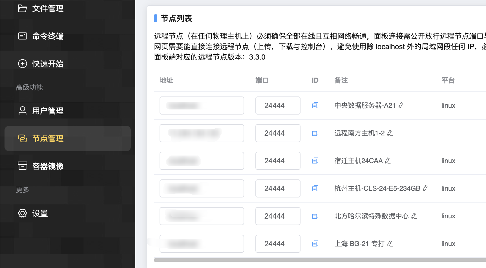

# 连接多台物理主机

## 这是什么？

如果您有多台物理主机可供使用，MCSManager 面板支持将多台主机连接起来，届时你将可以通过一个网页控制所有机器。

**如图所示**



## 如何连接

首先，请在每一个需要连接的机器上安装 `MCSManager`，可以使用一键脚本安装，然后只启动 `Daemon` 服务。

```bash
# 一键脚本安装后...

# 停止面板网页服务（必须）
# 如果不停止则有可能让其他人访问到面板初始化用户界面，从而入侵你的主机
systemctl stop mcsm-web

 # 禁用开机自启网页服务（必须）
systemctl disable mcsm-web

systemctl start mcsm-daemon     # 只启动面板守护进程服务，用来作为被控端
```

接下来，回到主面板，在左侧的 `节点管理` 界面，可以看见所有的守护进程，如果是 Localhost 则代表此服务在本地，您可以在全世界任何一台拥有公网 IP 的服务器上部署远程守护进程，然后利用此界面连接它。

点击 `新增远程节点`，填写相关信息，点击连接即可。

<br />

## 远程节点的密钥

密钥默认情况下会在启动时输出显示，请及时复制，或者去以下地方查找：

Linux：如果您使用一键安装脚本安装，那么默认路径应该是 /opt/mcsmanager/daemon/data/Config/global.json

Windows：<面板安装路径>/daemon/data/Config/global.json

<br />

## 连接协议

填写 `远程服务所在主机的IP地址` 时，您可以直接填写域名或 IP，但是如果有特殊需求，您也可以以 `ws://x.x.x.x` 或 `wss://x.x.x.x` 选择连接协议。

`ws` 对于 `http`，`wss` 对应 `https`。

> 如果您不知道这些意味着什么，那么就只需要填写 IP 地址，不需要带有任何前缀即可。

<br />
