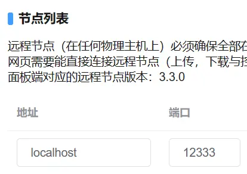
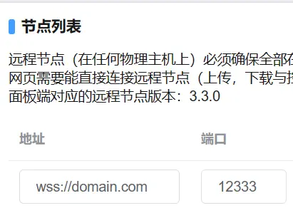

# 配置 HTTPS 反向代理且合并Web面板与守护节点的端口

> 合并端口通常仅用于Web面板与守护进程在同一主机的情况。  
> 本文基于 [配置HTTPS反向代理](reverse_proxy+ssl.md) 进行修改。  
> 若您只需要 HTTP 反向代理且合并端口，请参考 [配置HTTP反向代理且合并端口](http_proxy_merge_ports.md) 。  

注释：  
> 本地回环地址：例如域名 ***localhost*** 或IPv4 ***127.0.0.1*** 。  
> 守护进程：意思同守护节点、Daemon节点、Daemon进程、Daemon端。  

<br />

## 合并端口的原理

MCSManager访问守护进程的路径开头（与Web面板路径开头不冲突）：  
> /socket.io/  
> /upload/  
> /download/  

Nginx里的location匹配优先级从高到低是：  
```nginx
location =/test.txt {}              # 匹配完全相等的路径
location ~ (^/path/)|(^/path2/) {}  # 匹配正则表达式
location /path/ {}                  # 匹配单个路径开头
```

依据这些特性，将两者端口合并，以减少公网监听端口数量。   

<br />

## 生成SSL证书

为自己的域名生成有效的SSL证书，用于建立安全的HTTPS连接。  
可以在免费SSL的网站上，为自己的域名生成90天免费证书（可无限续签）。  
> <https://www.cersign.com/free-ssl-certificate.html>  
> <https://www.mianfeissl.com/>  

### ⚠别泄露私钥！私钥泄露会导致HTTPS形同虚设！

<br />

## 配置反向代理

以下示范内容的测试环境：  
> ***CentOS*** 操作系统  
> 使用yum安装的Nginx ***1.20.1***  
> 配置文件目录 ***/etc/nginx/nginx.conf***  
> Web面板 ***9.8.0***  
> 守护进程 ***3.3.0***  

```nginx
# For more information on configuration, see:
#   * Official English Documentation: http://nginx.org/en/docs/
#   * Official Russian Documentation: http://nginx.org/ru/docs/

user nginx;
worker_processes auto;
error_log /var/log/nginx/error.log;
pid /run/nginx.pid;

# Load dynamic modules. See /usr/share/doc/nginx/README.dynamic.
include /usr/share/nginx/modules/*.conf;

events {
    worker_connections 1024;
}

# 以上内容可能已经包含在nginx.conf里，确保目录在您的操作系统中有效即可。
#=======================================================================
# 以下才是需要理解并修改的内容，请依据自己的需求以及运行环境进行更改。
# 假设：
#    只需监听IPv4的端口
#    Daemon端真正监听的端口：24444
#    Web面板端真正监听的端口：23333
#    代理后端口：12333
#    ssl证书目录：/etc/nginx/ssl/domain.com.crt
#    ssl证书私钥目录：/etc/nginx/ssl/domain.com_rsa.key
#    需要允许主域名 domain.com 及其任意子域名访问

http {
    # 配置SSL证书。以下监听的ssl端口将默认使用该证书。
    #SSL-START
    ssl_certificate "/etc/nginx/ssl/domain.com.crt";
    ssl_certificate_key "/etc/nginx/ssl/domain.com_rsa.key";

    ssl_session_cache shared:SSL:1m;
    ssl_session_timeout  10m;
    ssl_protocols TLSv1.2; # 仅允许使用TLSv1.2建立连接
    ssl_verify_client off; # 不验证客户端的证书
    #SSL-END

    # 传输时默认开启gzip压缩
    gzip on;
    # 传输时会被压缩的类型（应当依据文件压缩效果添加）
    gzip_types text/plain text/css application/javascript application/xml application/json;
    # 反向代理时，启用压缩
    gzip_proxied any;
    # 传输时压缩等级，等级越高压缩消耗CPU越多，最高9级，通常5级就够了
    gzip_comp_level 5;
    # 传输时大小达到1k才压缩，压缩小内容无意义
    gzip_min_length 1k;

    # 响应头中的server仅返回nginx，不返回版本号。
    server_tokens  off;

    # 不限制客户端上传文件大小
    client_max_body_size 0;

    server {
        # 这块是用于阻止跨域访问的。

        # 代理后端口（可用多个listen监听多个端口）
        listen 12333 ssl ;

        # 若使用的域名在其它server{}中都无法匹配，则会匹配这里。
        server_name _ ;

        # 使用https访问时，直接断开连接，不返回证书。
        # 如果你需要套DNS的CDN高防，则不应该删除此块，那样更容易导致证书泄露，攻击者扫到IP后直接将源IP与域名绑定在一起。
        ssl_reject_handshake on;

        # 使用HTTP访问时，断开连接。
        error_page 497 =200 /;
        location / {
            return 444;
        }
    }
    server {
        # Daemon 端代理后localhost访问HTTP协议端口（可用多个listen监听多个端口）
        listen 127.0.0.1:12333 ;

        # 本地回环域名
        server_name localhost ;
        
        # 本地回环地址不占宽带，无需压缩。
        gzip off;

        # 开始反向代理
        # 代理Daemon节点
        location / {
            # 填写Daemon进程真正监听的端口号
            proxy_pass http://localhost:24444 ;

            # 一些请求头
            proxy_set_header Host $host;
            proxy_set_header X-Real-IP $remote_addr;
            proxy_set_header X-Forwarded-For $proxy_add_x_forwarded_for;
            proxy_set_header REMOTE-HOST $remote_addr;
            # 用于WebSocket的必要请求头
            proxy_set_header Upgrade $http_upgrade;
            proxy_set_header Connection "upgrade";
            # 增加响应头
            add_header X-Cache $upstream_cache_status;
            # 禁止客户端缓存，防止客户端未更新内容
            expires -1;
        }
    }
    server {
        # 代理后公网HTTPS端口（可用多个listen监听多个端口）
        listen 12333 ssl ;

        # 你访问时使用的域名（支持通配符，但通配符不能用于根域名）
        server_name domain.com *.domain.com ;

        # 使用HTTP访问时，断开连接。
        error_page 497 =200 /444nginx;
        location =/444nginx {
            return 444;
        }

        # 此处无需单独返回 robots.txt ，面板已包含该文件。

        # 开始反向代理
        # 代理Daemon节点
        location ~ (^/socket.io/)|(^/upload/)|(^/download/) {
            # 填写Daemon进程真正监听的端口号，后面不能加斜杠！
            proxy_pass http://localhost:24444 ;

            # 一些请求头
            proxy_set_header Host $host;
            proxy_set_header X-Real-IP $remote_addr;
            proxy_set_header X-Forwarded-For $proxy_add_x_forwarded_for;
            proxy_set_header REMOTE-HOST $remote_addr;
            # 用于WebSocket的必要请求头
            proxy_set_header Upgrade $http_upgrade;
            proxy_set_header Connection "upgrade";
            # 增加响应头
            add_header X-Cache $upstream_cache_status;
            # 禁止客户端缓存，防止客户端未更新内容
            expires -1;
        }
        # 代理Web端
        location / {
            # 填写Web面板端真正监听的端口号
            proxy_pass http://localhost:23333 ;

            # 一些请求头
            proxy_set_header Host $host;
            proxy_set_header X-Real-IP $remote_addr;
            proxy_set_header X-Forwarded-For $proxy_add_x_forwarded_for;
            proxy_set_header REMOTE-HOST $remote_addr;
            # 用于WebSocket的必要请求头
            proxy_set_header Upgrade $http_upgrade;
            proxy_set_header Connection "upgrade";
            # 增加响应头
            add_header X-Cache $upstream_cache_status;
            # 禁止客户端缓存，防止客户端未更新内容
            expires -1;
        }
    }
}
```

**配置完成后，重启 Nginx 服务（以下命令用于Linux操作系统）**
```bash
systemctl restart nginx
```

<br />

## 客户端访问面板

依据示范的配置内容，需要在系统内开启 **TLSv1.2**（通常默认开启）。  
假如域名是 ***domain.com*** ，反向代理后的端口是12333，那么浏览器需要使用这个地址访问面板：
```
https://domain.com:12333/
```

**⚠请确保反向代理后的端口都通过了服务器的防火墙，否则您是无法正常访问的。**  

<br />

## 连接守护进程

### 本地回环地址  
> 在**节点管理**中，填写地址为 ***localhost*** ，端口填写反向代理后的端口号（例如12333），然后单击右侧的 **连接** 或 **更新** 即可。  
> **⚠不能将地址填写为 *ws://localhost* ！这会导致浏览器尝试使用HTTP协议连接！**  
> 
> 

### 远程地址  
> 在**节点管理**中，将原有的地址前面添加 ***wss://*** 协议头，端口填写反向代理后的端口号（例如12333），然后单击右侧的 **连接** 或 **更新** 即可。  
> 例如以下两种原地址：
> > domain.com  
> > ws://domain.com  
> 
> 修改后：
> > wss://domain.com  
> 
> 

<br />

## 恭喜你，基础配置完成了！

为了安全，您应当在防火墙中，禁止通过以下端口访问：
> Web面板端真正监听的端口（例如23333）  
> Daemon端真正监听的端口（例如24444） 

（本地回环地址不受防火墙限制）  

<br />
