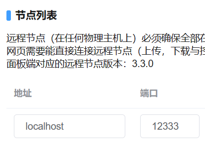

# 配置 HTTPS 反向代理且合并Web面板与守护节点的端口

本文基于 [配置HTTPS反向代理](reverse_proxy+ssl.md) 进行修改。  
若您只需要 HTTP 反向代理且合并端口，请参考 [配置HTTP反向代理且合并端口](http_proxy_merge_ports.md) 。  

合并端口通常仅用于Web面板与守护进程在同一主机的情况。  

此教程使用 Nginx 进行演示。  
> 本地回环地址：在本文是指域名 `localhost` 以及IPv4 `127.0.0.1` 。  
> 非本地回环地址：指不是 `本地回环地址` 。  
> 守护进程：意思同Daemon节点、Daemon进程、Daemon端。  
> Web面板后台：指Web面板的程序，不是守护进程，不是浏览器。  

### 警告：

当浏览器使用HTTPS访问Web面板时，浏览器访问守护进程也需要使用HTTPS。  
若为守护进程的`非本地回环地址`配置了HTTPS，并且Web面板后台也使用`非本地回环地址`访问守护进程，则需要确保`SSL证书有效`、访问的地址正确。否则Web面板后台会因为`SSL证书无效`而无法连接节点，会显示节点离线。  

<br />

## 简单说下合并端口的原理

在MCSManager中，访问Web端时，路径最前面始终不是 `/socket.io/` ，而访问守护节点时，路径最前面始终是 `/socket.io/` 。  
在Nginx中，当一个 `http{server{}}` 里的同时含有 `location /socket.io/{}` 与 `location /{}` 两种location模块，则会优先尝试匹配 `location /socket.io/{}` 。  
依据这些特性，我们可以使用反向代理，将两者端口合并，减少公网监听端口的占用数量。  

<br />

## 需要安装的

> [Nginx](https://nginx.org/)  
> [MCSManager](https://mcsmanager.com/)  

<br />

## 生成SSL证书

为自己的域名生成SSL证书，用于建立安全的HTTPS链接。  
可以在免费SSL的网站上，为自己的域名生成90天免费证书（可无限续签）。  
这里提供两个可以免费申请90天SSL证书的地址：
> https://www.cersign.com/free-ssl-certificate.html  
> https://www.mianfeissl.com/  

请勿泄露证书的私钥，攻击者拿到私钥后能劫持连接。  

<br />

## 配置反向代理

以下示范环境是`CentOS`操作系统内使用`yum install nginx`安装的Nginx`1.20.1`，配置文件目录`/etc/nginx/nginx.conf`，Web面板版本`9.8.0`，守护进程版本`3.3.0`。  

```nginx
# For more information on configuration, see:
#   * Official English Documentation: http://nginx.org/en/docs/
#   * Official Russian Documentation: http://nginx.org/ru/docs/

user nginx;
worker_processes auto;
error_log /var/log/nginx/error.log;
pid /run/nginx.pid;

# Load dynamic modules. See /usr/share/doc/nginx/README.dynamic.
include /usr/share/nginx/modules/*.conf;

events {
    worker_connections 1024;
}

# 以上内容可能已经包含在nginx.conf里，确保目录正确无误即可。
#========================================================
# 以下才是需要理解并修改的内容。
# 仅供参考，请依据自己的需求以及运行环境进行更改。
# 假设：
#    只需监听IPv4的端口
#    Daemon端真正监听的端口：24444
#    Web面板端真正监听的端口：23333
#    代理后端口：12333
#    ssl证书目录：/etc/nginx/ssl/domain.com.crt
#    ssl证书私钥目录：/etc/nginx/ssl/domain.com_rsa.key
#    需要允许主域名 domain.com 及其任意子域名访问

http {
    # 配置SSL证书。以下监听的ssl端口将默认使用该证书。
    # 你的域名证书crt文件所在目录
        ssl_certificate /etc/nginx/ssl/domain.com.crt;
    # 你的域名证书私钥key文件所在目录
        ssl_certificate_key /etc/nginx/ssl/domain.com_rsa.key;

    ssl_session_cache shared:SSL:1m;
    ssl_session_timeout  10m;
    ssl_protocols TLSv1.2; # 仅允许使用TLSv1.2建立连接
    ssl_verify_client off; # 关闭客户端证书验证

    # 这块是在传输时默认开启gzip压缩
    gzip on;
    # 传输时需要被压缩的类型
    gzip_types text/plain text/css application/javascript application/xml application/json image/png;
    # 反向代理时，启用压缩
    gzip_proxied any;
    # 传输时压缩等级，等级越高压缩消耗CPU越多，最高9级。
    gzip_comp_level 5;
    # 传输时大小达到1k才压缩
    gzip_min_length 1k;

    # 响应头中的server仅返回nginx，不返回版本号。
    server_tokens  off;

    server {
        # 这块是用于阻止跨域访问的。

        # 代理后端口
            listen 12333 ssl;
        # 可以通过多个listen监听多个地址与端口。

        server_name _; #若使用的域名在其它server{}中都无法匹配，则会匹配这里。

        # 使用https访问时，直接断开连接，不返回证书。
        # 如果你需要套DNS的CDN高防，则不应该删除此块，那样更容易导致证书泄露，攻击者扫到IP后直接将源IP与域名绑定在一起。
        ssl_reject_handshake on;

        # 使用HTTP访问时，断开连接。
        error_page 497 =200 /;
        location / {
            return 444;
        }
    }
    server {
        # Daemon 端代理后localhost访问HTTP协议端口
            listen 127.0.0.1:12333;
        # 可以通过多个listen监听多个地址与端口。

        # 本地回环域名
        server_name localhost;
        
        gzip off; # 本地回环地址不占用宽带，不需要压缩。

        # 开始反向代理
        # 代理Daemon节点
        location /socket.io/ {
            # 填写Daemon进程真正监听的端口号，不要漏掉后面的路径与斜杠！
                proxy_pass http://localhost:24444/socket.io/;

            # 一些必要的请求头
            proxy_set_header Host $host:$server_port;
            proxy_set_header X-Real-IP $remote_addr;
            proxy_set_header X-Forwarded-For $proxy_add_x_forwarded_for;
            proxy_set_header REMOTE-HOST $remote_addr;
            proxy_set_header Upgrade $http_upgrade;
            proxy_set_header Connection "upgrade";
            # 增加响应头
            add_header X-Cache $upstream_cache_status;
            add_header Cache-Control no-store; # 禁止客户端缓存，防止更新不及时
        }
    }
    server {
        # 代理后公网HTTPS端口
            listen 12333 ssl;
        # 可以通过多个listen监听多个地址与端口。

        # 你访问时使用的域名（支持通配符，但通配符不能用于根域名）
            server_name domain.com *.domain.com;

        deny 127.0.0.1; # 禁止来源127.0.0.1的IP访问，这块主要是测试的时候为了确保localhost真的不是访问这里。

        # 在示范内容之前已经填了ssl证书相关配置，因此这里并没有ssl配置。您也可以在此处单独配置ssl。

        # 使用HTTP访问时，断开连接。
        error_page 497 =200 /444nginx;
        location =/444nginx {
            return 444;
        }
        
        # 绝对防止搜索引擎收录
        location =/robots.txt{
            default_type text/plain;
            return 200 "User-agent: *\nDisallow: /";
        }

        # 开始反向代理
        # 代理Daemon节点
        location /socket.io/ {
            # 填写Daemon进程真正监听的端口号，不要漏掉后面的路径与斜杠！
                proxy_pass http://localhost:24444/socket.io/;

            # 一些必要的请求头
            proxy_set_header Host $host:$server_port;
            proxy_set_header X-Real-IP $remote_addr;
            proxy_set_header X-Forwarded-For $proxy_add_x_forwarded_for;
            proxy_set_header REMOTE-HOST $remote_addr;
            proxy_set_header Upgrade $http_upgrade;
            proxy_set_header Connection "upgrade";
            # 增加响应头
            add_header X-Cache $upstream_cache_status;
            add_header Cache-Control no-store; # 禁止客户端缓存，防止更新不及时
        }
        # 代理Web端
        location / {
            # 填写Web面板端真正监听的端口号，不要漏掉后面的斜杠！
                proxy_pass http://localhost:23333/;

            # 一些必要的请求头
            proxy_set_header Host $host:$server_port;
            proxy_set_header X-Real-IP $remote_addr;
            proxy_set_header X-Forwarded-For $proxy_add_x_forwarded_for;
            proxy_set_header REMOTE-HOST $remote_addr;
            proxy_set_header Upgrade $http_upgrade;
            proxy_set_header Connection "upgrade";
            # 增加响应头
            add_header X-Cache $upstream_cache_status;
            add_header Cache-Control no-stone; # 禁止客户端缓存，防止更新不及时
        }
    }

}
```
配置完成后，重启 Nginx 服务（以下命令用于Linux操作系统）
```bash
systemctl restart nginx
```

<br />

## 客户端访问时，需要注意的

依据示范的配置内容，需要在系统内开启`TLSv1.2`（通常默认开启），且直接使用 `https://` 协议访问，而不要使用 `http://` 协议。  
假设域名是`domain.com`，反向代理后的端口是`12333`，那么浏览器需要使用这个地址访问面板：
```
https://domain.com:12333/
```

请确保反向代理后的端口都通过了服务器的防火墙，否则您是无法正常访问的。  

<br />

## Web面板后台使用 WS 协议连接`本地回环地址`的守护进程

在[守护进程管理](connect_daemon.md)里，填写地址为 `localhost` ，端口填写反向代理后的端口号（例如12333），然后单击右侧的 `连接` 或 `更新` 即可。  
请注意：不能将地址填写为 `ws://localhost` ！这会导致浏览器尝试使用HTTP协议连接！  



<br />

## Web面板后台使用 WSS 协议连接`非本地回环地址`的守护进程

由于您为守护进程的 `非本地回环地址` 配置了HTTPS访问或修改了代理后端口，且Web面板后台使用 `非本地回环地址` 连接守护进程，此时守护进程管理界面中，该节点状态可能是离线的。  

在[守护进程管理](connect_daemon.md)里，将原有的地址前面添加 `wss://` 协议头，端口填写反向代理后的端口号（例如12333），然后单击右侧的 `连接` 或 `更新` 即可。

例如以下两种原地址：
> domain.com  
> ws://domain.com  

修改后：
> wss://domain.com  


<br />

## 大功告成

依据以上步骤，您的面板以及守护进程的https协议访问应该正常工作。  
为了安全，您应当在防火墙中，禁止公网设备通过以下端口访问：
> Web面板端真正监听的端口（例如23333）  
> Daemon端真正监听的端口（例如24444） 
 
<br />
