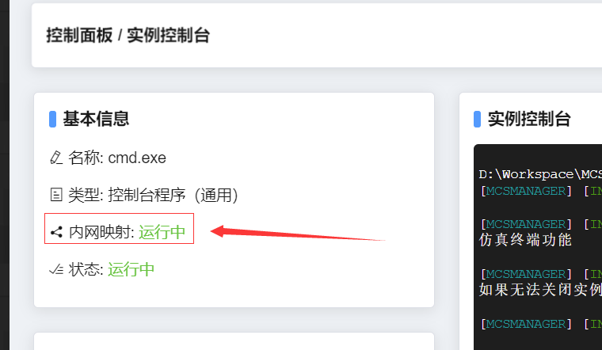

# 使用内网映射与朋友进行联机
## 注意！暂时只能在后端(daemon端)在Windows系统运行才能正常使用

## 1. 进入 OpenFrp 官网注册账号

前往 https://www.openfrp.net/ 网站注册账号并完成实名认证（国家政策）。

 

## 2. 进入 OpenFrp 管理面板创建隧道

前往 https://www.openfrp.net/home/dashboard 点击左侧 “创建隧道” 按钮，选择一个节点（尽可能离自己所在点近的地方），生成随机隧道名+随机远程端口，本地端口可以填写为 25565。

 

## 3. 保存创建好的隧道 ID 和用户密钥

复制这两个信息，后续将要使用。

 

## 4. 将隧道 ID 和用户密钥填写到 MCSManager 管理面板中

如果你使用 “快速开始” 中的一键开服，那么你应该看见这个界面：

输入从 OpenFrp 管理面板中的密钥和生成的隧道 ID，点击保存后，下次启动你的 Minecraft 服务器时，将会自动触发内网映射。

> 此界面在左侧菜单的应用实例->实例右上角三个点->编辑配置->底部联机方式。

启动服务器（实例）后，左上角显示这个代表成功。

接下来你就可以根据 OpenFrp 给你的地址+端口发送给你的朋友实现联机。

 

## 5. 你的 IP 地址

把这个地址发给你的朋友就可以实现联机。

