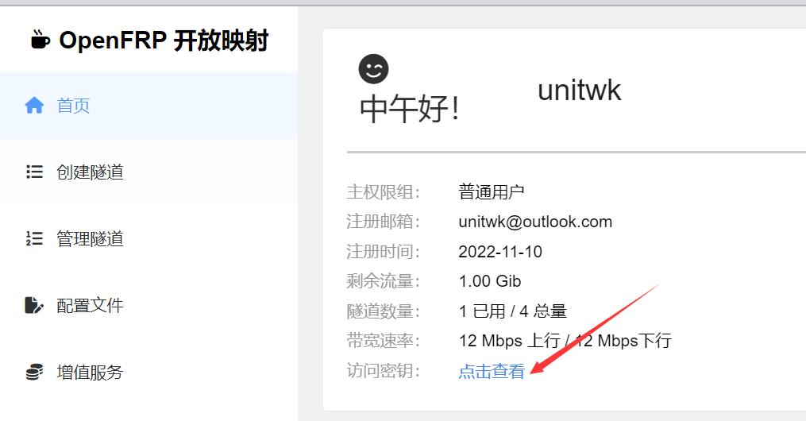
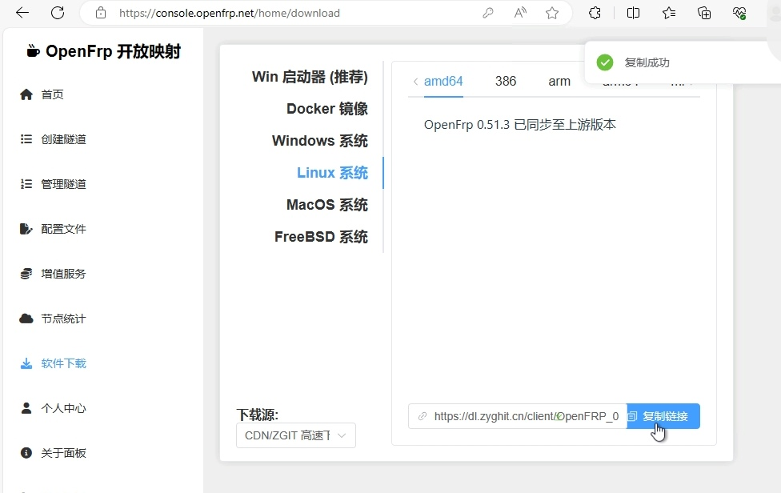
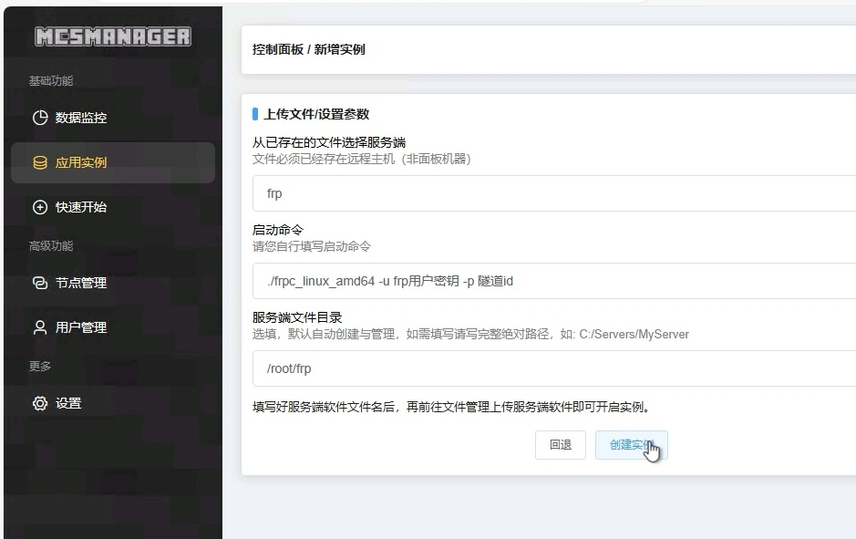
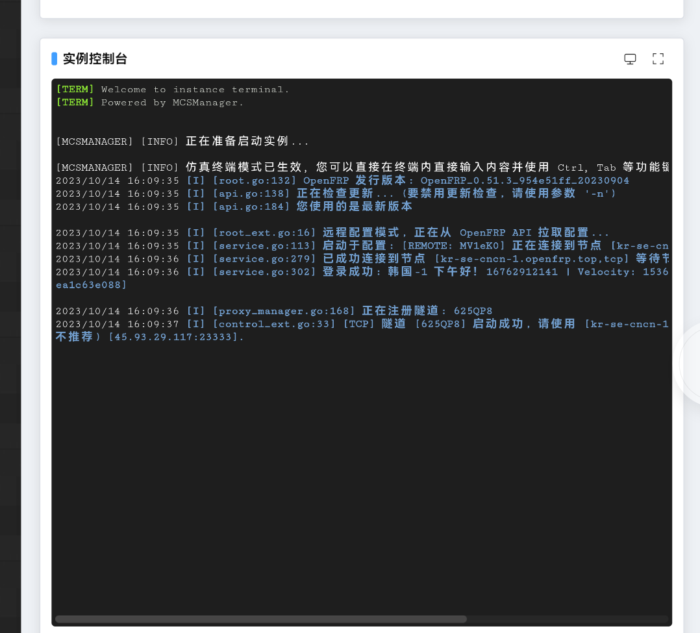
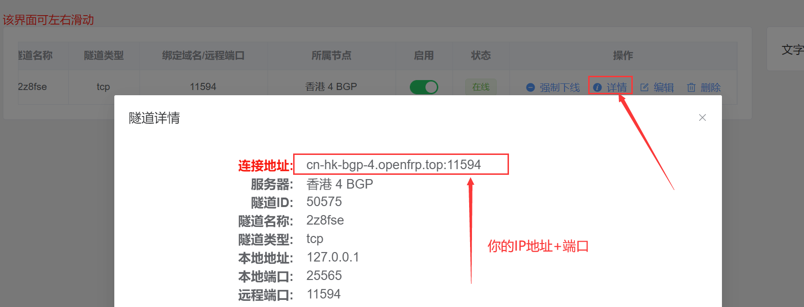

# 使用内网映射与朋友进行联机(linux临时解决方案)

## 1. 进入 OpenFrp 官网注册账号

前往 https://www.openfrp.net/ 网站注册账号并完成实名认证（国家政策）。

<br />

## 2. 进入 OpenFrp 管理面板创建隧道

前往 https://www.openfrp.net/home/dashboard 点击左侧 “创建隧道” 按钮，选择一个节点（尽可能离自己所在点近的地方），生成随机隧道名+随机远程端口，本地端口可以填写为 25565。


<br />

## 3. 保存创建好的隧道 ID 和用户密钥

复制这两个信息，后续将要使用。




<br />

## 4. 去OpenFrp软件下载页获取下载链接



<br />

## 5. 新建一个应用实例

选择通用控制台应用程序类型

选择无需文件或选择已存在文件类

启动命令填写./frpc_linux_amd64 -u frp用户密钥 -p 隧道ID

服务端文件目录随意填写，此处以 **/root/frp** 目录作为文件存放目录



下载frp客户端
使用ssh连接服务器

``` bash
cd /root/frp
# 前往frp文件存放目录
wget https://dl.zyghit.cn/client/OpenFRP_0.51.3_954e51ff_20230904/frpc_linux_amd64.tar.gz
# wget 第四步复制的下载链接
tar vxf frpc_linux_amd64.tar.gz
# 解压压缩包
chmod +x frpc_linux_amd64 
# 添加权限
```
## 6. 启动实例



接下来你就可以根据 OpenFrp 给你的地址+端口发送给你的朋友实现联机。

<br />

## 5. 你的 IP 地址

把这个地址发给你的朋友就可以实现联机。


