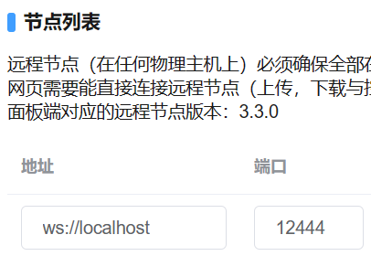

# 使用反向代理配置 HTTPS

此教程使用 Nginx 进行演示。  
您应当 `充分理解` 本文的内容，便于依据自己的需求进行更改。  
文中提到的 `本地回环地址` 在本文是指域名`localhost`以及IPv4`127.0.0.1`。  
文中提到的 `非本地回环地址` 在本文指 不是`localhost` 这种 `本地回环地址` 。  
文中提到的 `WS协议` 基于 `HTTP协议` 通道，`WSS协议` 基于 `HTTPS协议` 通道。  

### 警告：

当浏览器使用HTTPS访问Web面板时，浏览器访问Deamon节点也需要使用HTTPS。  
若为 `Daemon节点` 的 `非本地回环地址` 配置了HTTPS，并且 `Web面板后台` 也使用 `非本地回环地址` 访问Daemon节点，则需要确保 `证书有效` 、访问的地址正确。否则 `Web面板后台` 会因为 `证书验证不通过` 而无法连接节点，会显示节点离线。  
若您 `未理解` 本文的主要内容，则 `不建议` 配置HTTPS。  
内容仅供参考，不绝对确保稳定性，不确保时效性。  

<br />

## 需要安装的

> Nginx  
> MCSManager  

<br />

## 生成 SSL 证书

为自己的域名生成 `SSL` 证书，用于建立安全的 `HTTPS` 链接。  
可以在免费SSL的网站上，为自己的域名生成90天免费证书（可无限续签）。  
这里提供两个可以免费申请90天SSL证书的地址：
> https://www.cersign.com/free-ssl-certificate.html  
> https://www.mianfeissl.com/  

<br />

## 配置反向代理

参考：[反向代理](/tutorial/simple_reverse_proxy.md)。  

以下示范环境是 `CentOS` 操作系统内使用 `yum install nginx` 安装的Nginx，配置文件目录 `/etc/nginx/nginx.conf` ，  
Web面板版本 `9.8.0` ，守护进程版本 `3.3.0` 。  
内容仅供参考，请依据自己的需求进行更改。  
`<>`这俩符号需要按里面描述的内容进行填写（填写时别带这俩符号！）。  
```nginx
# For more information on configuration, see:
#   * Official English Documentation: http://nginx.org/en/docs/
#   * Official Russian Documentation: http://nginx.org/ru/docs/

user nginx;
worker_processes auto;
error_log /var/log/nginx/error.log;
pid /run/nginx.pid;

# Load dynamic modules. See /usr/share/doc/nginx/README.dynamic.
include /usr/share/nginx/modules/*.conf;

events {
    worker_connections 1024;
}

# 以上内容在nginx配置文件中默认包含，无需修改。
#======================================================
# 以下才是需要修改的内容。
# <> 这俩符号需要按里面描述的内容进行填写（填写时别带这俩符号！）。  

http {
    # 配置SSL证书。以下监听的ssl端口将默认使用该证书。
    ssl_certificate <你的域名证书crt文件所在目录>; #！！！注意此处需要填写<>！！！
    ssl_certificate_key <你的域名证书私钥key文件所在目录>; #！！！注意此处需要填写<>！！！
    ssl_session_cache shared:SSL:1m;
    ssl_session_timeout  10m;
    ssl_protocols TLSv1.2; # 仅允许使用TLSv1.2建立连接
    ssl_verify_client off; # 关闭客户端证书验证

    # 这块是在传输时默认开启gzip压缩
    gzip on;
    # 传输时需要被压缩的类型
    gzip_types text/plain text/css application/javascript application/xml application/json image/png;
    # 反向代理时，启用压缩
    gzip_proxied any;
    # 传输时压缩等级，最高9级
    gzip_comp_level 5;
    # 传输时大小达到1k才压缩
    gzip_min_length 1k;

    # 响应头中的server仅返回nginx，不返回版本号。
    server_tokens  off;

    server {
        # 这块是用于阻止跨域访问的。

        # Daemon 端访问端口
        listen <代理后的端口> ssl; #！！！注意此处需要填写<>！！！
        # 可以通过多个listen监听多个地址与端口。

        # Web面板访问端口
        listen <代理后的端口> ssl; #！！！注意此处需要填写<>！！！
        # 可以通过多个listen监听多个地址与端口。

        server_name _; #若使用的域名在其它server{}中都无法匹配，则会匹配这里。
        ssl_reject_handshake on; # 使用https访问时，直接断开连接，不返回证书。
        error_page 497 =200 /; # 使用http访问https端口时返回的内容。
        location / {
            return 444; # 直接断开连接，不发送任何响应头。
        }
    }
    server {
        # Daemon 端localhost访问HTTP协议端口
        listen 127.0.0.1:<代理后的端口>; #！！！注意此处需要填写<>！！！
        # 可以通过多个listen监听多个地址与端口。

        server_name localhost; # 本地回环域名
        
        gzip off; # 本地回环地址不占用宽带，不需要压缩。

        # 开始反向代理
        location / {
            proxy_pass http://localhost:<Daemon进程真正监听的端口号>; #！！！注意此处需要填写<>！！！
            proxy_set_header Host $host:$server_port;
            proxy_set_header X-Real-IP $remote_addr;
            proxy_set_header X-Forwarded-For $proxy_add_x_forwarded_for;
            proxy_set_header REMOTE-HOST $remote_addr;
            proxy_set_header Upgrade $http_upgrade;
            proxy_set_header Connection "upgrade";
            add_header X-Cache $upstream_cache_status;
            add_header Cache-Control no-store; # 禁止客户端缓存，防止更新不及时
        }
    }
    server {
        # Daemon 端公网HTTPS端口
        listen <代理后的端口> ssl; #！！！注意此处需要填写<>！！！
        # 可以通过多个listen监听多个地址与端口。

        server_name <你访问时使用的域名> <也可以通过空格分割，填写多个域名>; #！！！注意此处需要填写<>！！！
        deny 127.0.0.1; # 这块主要是测试的时候为了确保localhost真的不是访问这个。

        # 在示范内容之前已经填了ssl证书相关配置，因此这里并没有ssl配置。您也可以在此处单独配置ssl。

        # 使用HTTP访问时，断开链接。
        error_page 497 =200 /444nginx;
        location =/444nginx {
            return 444;
        }
        
        # 绝对防止搜索引擎收录
        location =/robots.txt{
            default_type text/plain;
            return 200 "User-agent: *\nDisallow: /";
        }

        # 开始反向代理
        location / {
            proxy_intercept_errors on; #捕捉到错误状态码时，让nginx可以决定返回的错误页面。
            proxy_pass http://localhost:<Daemon进程真正监听的端口号>; #！！！注意此处需要填写<>！！！
            proxy_set_header Host $host:$server_port;
            proxy_set_header X-Real-IP $remote_addr;
            proxy_set_header X-Forwarded-For $proxy_add_x_forwarded_for;
            proxy_set_header REMOTE-HOST $remote_addr;
            proxy_set_header Upgrade $http_upgrade;
            proxy_set_header Connection "upgrade";
            add_header X-Cache $upstream_cache_status;
            add_header Cache-Control no-store; # 禁止客户端缓存，防止更新不及时
        }
    }
    server {
        # Web 端公网HTTPS端口
        listen <代理后的端口> ssl; #！！！注意此处需要填写<>！！！
        # 可以通过多个listen监听多个地址与端口。

        server_name <你访问时使用的域名> <也可以通过空格分割，填写多个域名>; #！！！注意此处需要填写<>！！！
        
        # 在示范内容之前已经填了ssl证书相关配置，因此这里并没有ssl配置。您也可以在此处单独配置ssl。

        # 使用HTTP访问时，断开链接。
        error_page 497 =200 /444nginx;
        location =/444nginx {
            return 444;
        }

        # 绝对防止搜索引擎收录
        location =/robots.txt{
            default_type text/plain;
            return 200 "User-agent: *\nDisallow: /";
        }

        # 开始反向代理
        location / {
            proxy_pass http://localhost:<Web面板端真正监听的端口号>; #！！！注意此处需要填写<>！！！
            proxy_set_header Host $host:$server_port;
            proxy_set_header X-Real-IP $remote_addr;
            proxy_set_header X-Forwarded-For $proxy_add_x_forwarded_for;
            proxy_set_header REMOTE-HOST $remote_addr;
            proxy_set_header Upgrade $http_upgrade;
            proxy_set_header Connection "upgrade";
            add_header X-Cache $upstream_cache_status;
            add_header Cache-Control no-stone; # 禁止客户端缓存，防止更新不及时
        }
    }

}
```

<br />

## 使用 WS 协议连接 `本地回环地址` 的守护进程

在 [守护进程管理](/tutorial/connect_daemon.md) 里，填写地址为 `localhost` ，然后单击右侧的 `连接` 或 `更新` 即可。


也可以将地址填写为 `ws://localhost` 。



<br />

## 使用 WSS 协议连接 `非本地回环地址` 的守护进程

由于您为 `守护进程` 的 `非本地回环地址` 配置了 HTTPS 访问，且Web面板后台使用 `非本地回环地址` 连接 `守护进程` ，此时守护进程管理界面中，该节点应当是离线的。  

在 [守护进程管理](/tutorial/connect_daemon.md) 里，将原有的地址前面添加 `wss://` 协议头，然后单击右侧的 `连接` 或 `更新` 即可。

如原有的地址：`domain.com` 或 `ws://domain.com`，修改后：`wss://domain.com`。  


<br />

## 客户端访问时，需要注意的

请不要使用IE浏览器或其它版本过旧的浏览器访问。  
建议使用版本较新的 `Google Chrome` 或 `Microsoft Edge` 或 `Mozilla FireFox` 。  
依据示范的配置内容，需要在系统内开启 `TLSv1.2` （通常默认开启），且应当直接使用 `https://` 协议访问，而不要使用 `http://` 协议。  

## 大功告成

根据以上步骤，您的全面板 https 访问应该正常工作。  

<br />
