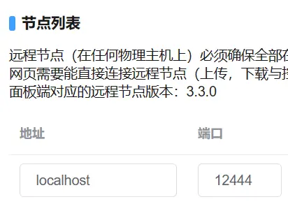

# 配置 HTTP 反向代理

如果操作系统的包管理器自带的nginx版本太低（例如ubuntu），请编译安装最新版nginx。  

```nginx
# 以下http块才是需要理解并修改的内容，请依据自己的需求以及运行环境进行更改。
# 假设：
#    Daemon端真正监听的端口：24444
#    Daemon端代理后端口：12444
#    Web面板端真正监听的端口：23333
#    Web面板端代理后端口：12333
#    需要允许主域名 domain.com 及其所有子域名访问

http {
    # 传输时默认开启gzip压缩
    gzip on;
    # 传输时会被压缩的类型（应当依据文件压缩效果添加）
    gzip_types text/plain text/css application/javascript application/xml application/json;
    # 反向代理时，启用压缩
    gzip_proxied any;
    # 传输时压缩等级，等级越高压缩消耗CPU越多，最高9级，通常5级就够了
    gzip_comp_level 5;
    # 传输时大小达到1k才压缩，压缩小内容无意义
    gzip_min_length 1k;

    # 响应头中的server仅返回nginx，不返回版本号。
    server_tokens  off;

    # 不限制客户端上传文件大小
    client_max_body_size 0;

    server {
        # Daemon 端代理后的localhost访问HTTP协议端口（可用多个listen监听多个端口）
        listen 127.0.0.1:12444 ;
        listen [::1]:12444 ; #IPv6

        # 本地回环域名
        server_name localhost ;

        # 本地回环地址不占宽带，无需压缩。
        gzip off;

        # 开始反向代理
        location / {
            # 填写Daemon端真正监听的端口号
            proxy_pass http://localhost:24444 ;

            # 一些请求头
            proxy_set_header Host $host;
            proxy_set_header X-Real-IP $remote_addr;
            proxy_set_header X-Forwarded-For $proxy_add_x_forwarded_for;
            proxy_set_header REMOTE-HOST $remote_addr;
            # 用于WebSocket的必要请求头
            proxy_set_header Upgrade $http_upgrade;
            proxy_set_header Connection "upgrade";
            # 增加响应头
            add_header X-Cache $upstream_cache_status;
        }
    }
    server {
        # Daemon 端代理后的公网访问HTTP协议端口（可用多个listen监听多个端口）
        listen 12444 ;
        listen [::]:12444 ; #IPv6

        # 你访问时使用的域名（支持通配符，但通配符不能用于根域名）
        # 如果你访问时的链接直接使用公网IP，那么此处填写公网IP。
        server_name domain.com *.domain.com ;

        # 开始反向代理
        location / {
            # 填写Daemon端真正监听的端口号
            proxy_pass http://localhost:24444 ;

            # 一些请求头
            proxy_set_header Host $host;
            proxy_set_header X-Real-IP $remote_addr;
            proxy_set_header X-Forwarded-For $proxy_add_x_forwarded_for;
            proxy_set_header REMOTE-HOST $remote_addr;
            # 用于WebSocket的必要请求头
            proxy_set_header Upgrade $http_upgrade;
            proxy_set_header Connection "upgrade";
            # 增加响应头
            add_header X-Cache $upstream_cache_status;
        }
    }
    server {
        # Web 端代理后的公网访问HTTP端口（可用多个listen监听多个端口）
        # 如果你访问时的链接直接使用公网IP，那么此处填写公网IP。
        listen 12333 ;
        listen [::]:12333 ; #IPv6

        # 你访问时使用的域名（支持通配符，但通配符不能用于根域名）
        server_name domain.com *.domain.com ;

        # 此处无需单独返回 robots.txt ，面板已包含该文件。

        # 开始反向代理
        location / {
            # 填写Web面板端真正监听的端口号
            proxy_pass http://localhost:23333 ;

            # 一些请求头
            proxy_set_header Host $host;
            proxy_set_header X-Real-IP $remote_addr;
            proxy_set_header X-Forwarded-For $proxy_add_x_forwarded_for;
            proxy_set_header REMOTE-HOST $remote_addr;
            # 用于WebSocket的必要请求头
            proxy_set_header Upgrade $http_upgrade;
            proxy_set_header Connection "upgrade";
            # 增加响应头
            add_header X-Cache $upstream_cache_status;
        }
    }
}
```

**配置完成后，重载 Nginx 配置（以下命令用于Linux操作系统）**
```bash
systemctl reload nginx
```

<br />

## 客户端访问面板

假如域名是 ***domain.com*** ，反向代理后的端口是12333，那么浏览器需要使用这个地址访问面板：
```
http://domain.com:12333/
```

**⚠请确保反向代理后的端口都通过了服务器的防火墙，否则您是无法正常访问的。**  
⚠如果使用NAT端口，请确保内外端口号一致。  

<br />

## 连接Daemon端

假如Web面板后台通过 ***localhost*** 域名连接节点，那么在**节点管理**中填写地址为 ***localhost*** 或 ***ws://localhost*** ，端口填写反向代理后的端口号（例如12333），然后单击右侧的 **连接** 或 **更新** 即可。  
假如需要填远程地址 ***domain.com*** ，那么将 ***localhost*** 改为 ***domain.com*** 即可。


