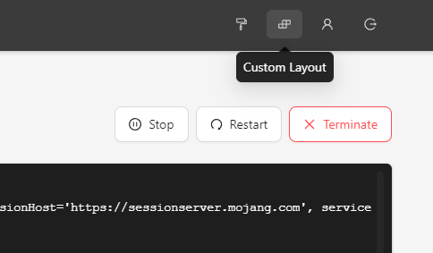
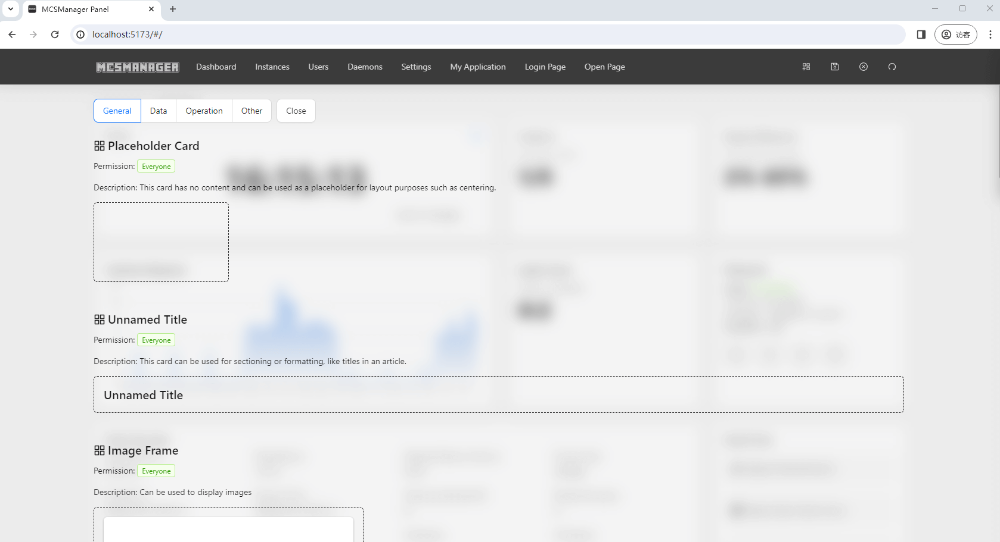
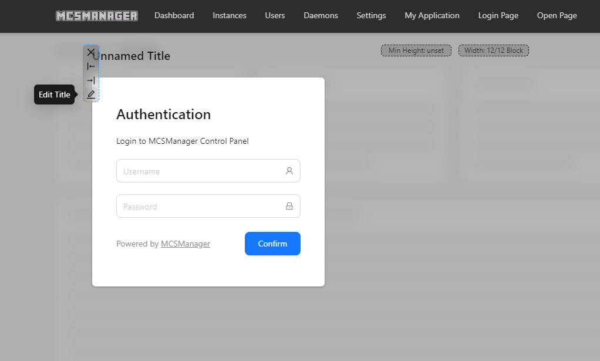
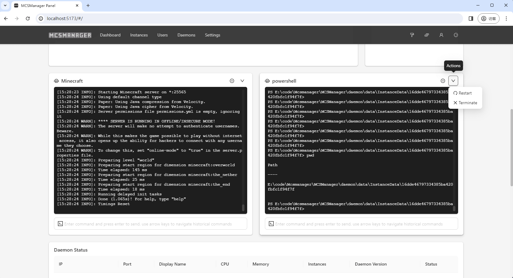
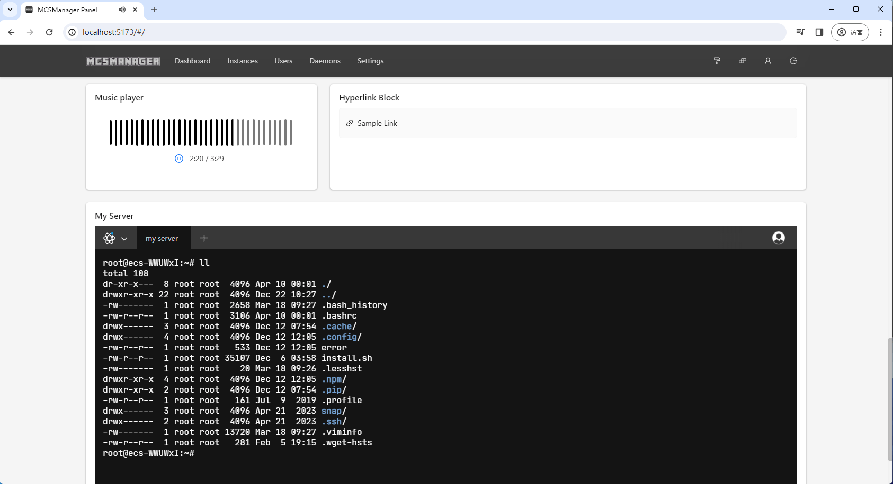
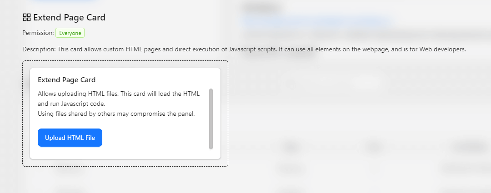
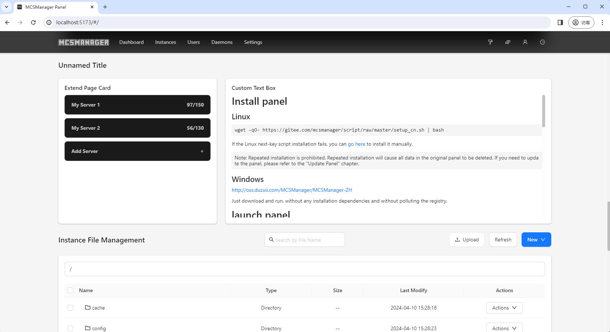

# 自定义页面

:::tip
由于界面的高度可定制化，设置自定义页面后将无法切换面板显示语言。强制切换可能无法达到预期的效果。
:::

## 卡片化

自 `MCSManager 10` 起，用户可使用拖拽卡片的方式自定义任何能看到的页面。

## 自定义

::: warning

请按需添加卡片，若一个页面添加过多卡片，可能导致网页性能下降。

:::

在任意界面点击面板右上角的自定义布局按钮，既可进入编辑模式。

在编辑模式中，您可以在任意位置插入卡片，修改卡片标题，调整卡片尺寸等。

可用的卡片包括但不仅限于时间、音乐、图片、网页、面板信息、实例、设置。您在面板中看到的一切，他们皆为卡片。

## 不止主页

除了常见的几个管理页面，MCSManager 还允许您编辑登录页、普通用户主页、开放页等各种能访问到的页面。

## 在主页管理多个实例

通过自定义布局的功能，可以让您在一个页面上管理多个实例。

## 扩展性

卡片拥有极高的扩展性，他可以让您在面板中一边听音乐一边使用 SSH 连接服务器

## HTML 卡片

您可以上传自定义 HTML 作为卡片的内容，自定义 HTML 卡片拥有非常高的扩展性，使用自定义 HTML ，您可以[自行开发](../apis/html_card.html)更多卡片，也可以安装其他人开发的实用卡片。不过使用时需要注意安全问题，上传来源不明的代码可能导致面板被入侵。

