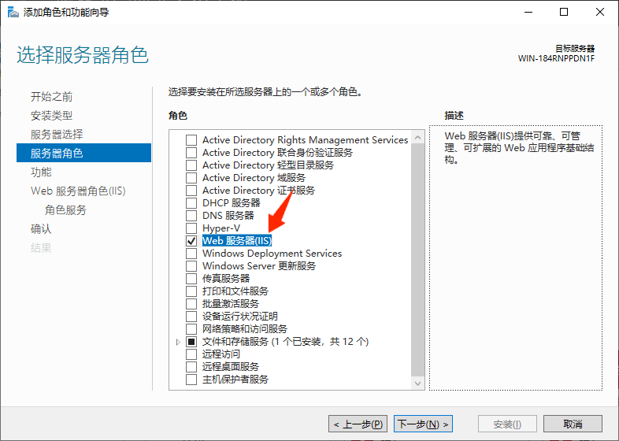
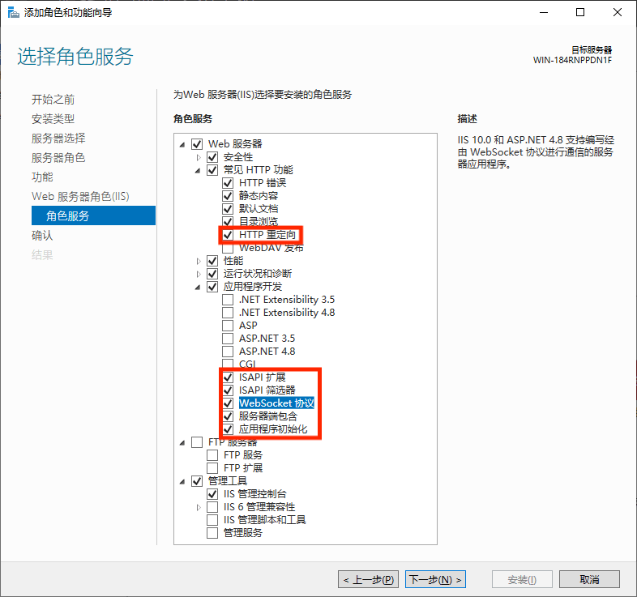
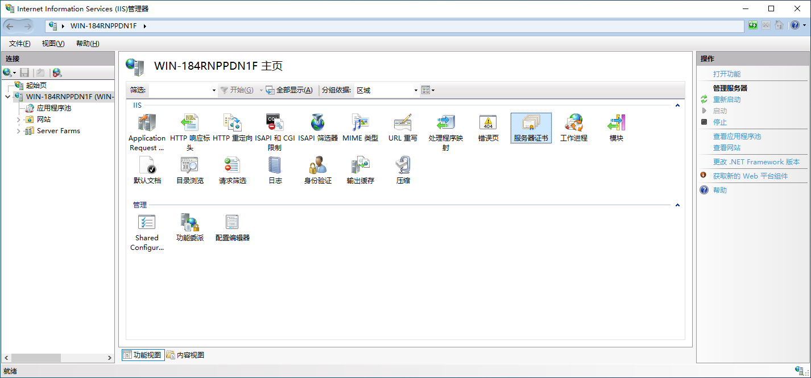
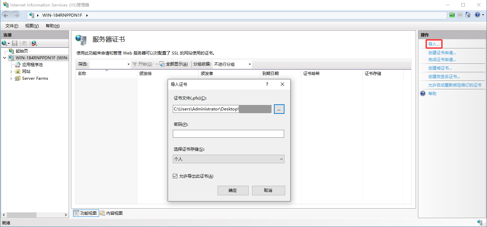
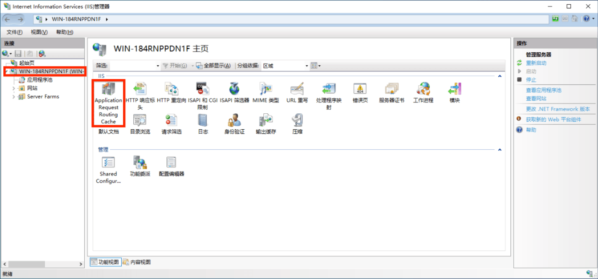
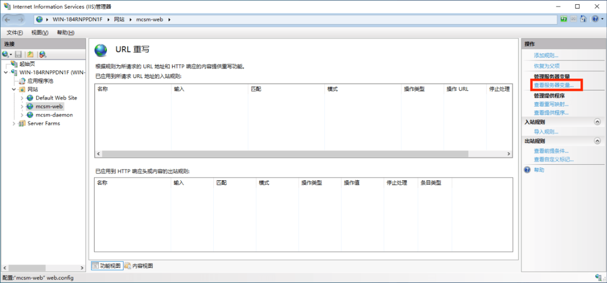
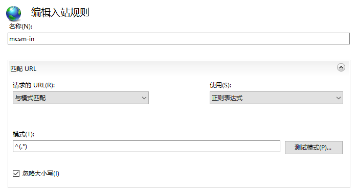
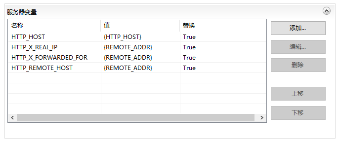
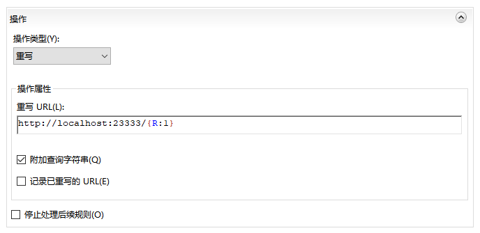

# 通过 IIS 配置 HTTPS

:::tip
**请确保你已经充分理解「网络架构」章节。**
:::

## 生成 SSL 证书

可以在免费 SSL 的网站上，为自己的域名生成 90 天免费且可无限续签的证书：

> <a href="https://ohttps.com/" target="_blank">https://ohttps.com/</a>  
> <a href="https://www.mianfeissl.com/" target="_blank">https://www.mianfeissl.com/</a>

如果你没有域名，想直接用 IP 地址访问，可以在此生成证书：

> <a href="https://zerossl.com/" target="_blank">https://zerossl.com/</a>

你也可以选择使用`Let's Encrypt`、`其他CA`或`自签名SSL证书`。注意自签名证书默认不被操作系统及浏览器信任，需要手动加入信任链。

```使用OpenSSL生成自签名证书
openssl req -x509 -newkey rsa:4096 -keyout key.pem -out cert.pem -sha256 -days 365
```

## 转换 SSL 证书/准备证书链文件

请准备以下文件:

1. 已签发的证书，例如 **_domain.crt_**。
2. 签发证书的中级 CA，可从签发机构网站下载。例如 **_ca.crt_**。
3. 已签发证书对应的私钥，例如 **_domain.key_**。

后续示例将使用 **_domain.crt_**, **_ca.crt_**, **_domain.key_** 作为示例名。

Windows 系统证书存储无法直接导入pem格式，故需要转换成pfx：

```
openssl pkcs12 -export -out certificate.pfx -inkey domain.key -in domain.crt
```

一般情况下不需要集成证书链，因为通常 Windows 内置信任列表已经信任所需的证书链，如果因为一些原因需要集成证书链，请使用以下命令：

```
openssl pkcs12 -export -out certificate.pfx -inkey domain.key -in domain.crt -certfile ca.crt
```

## 安装 IIS

### Windows Server

1. 打开 `服务器管理器` 并点击 `管理` > `添加角色和功能`
2. 导航到 `服务器角色` 并勾选 `Web服务器(IIS)`

3. 点击 `Web服务器角色(IIS)`/`角色服务`
4. 添加以下功能

    - 常见HTTP功能
      - HTTP重定向
    - 应用程序开发
      - CGI
      - ISAPI扩展
      - ISAPI筛选器
      - 服务器端包含
      - WebSocket协议
5. 点击 `确认` 并 `安装`

### 面向消费者的 Windows

按下 `Win+R`，输入 `optionalfeatures` 并按回车。

参考上述 Windows Server 教程勾选 `Internet Information Services` 并在 `万维网服务` 子项目中勾选对应附加功能后安装。

## 安装前提插件

### [Application Request Routing](https://www.iis.net/downloads/microsoft/application-request-routing)
[32位](https://go.microsoft.com/fwlink/?LinkID=615135) / [64位](https://go.microsoft.com/fwlink/?LinkID=615136)

### [URL 重写](https://www.iis.net/downloads/microsoft/url-rewrite)
- **English:** [32位](https://download.microsoft.com/download/D/8/1/D81E5DD6-1ABB-46B0-9B4B-21894E18B77F/rewrite_x86_en-US.msi) / [64位](https://download.microsoft.com/download/1/2/8/128E2E22-C1B9-44A4-BE2A-5859ED1D4592/rewrite_amd64_en-US.msi)
- **German:** [32位](https://download.microsoft.com/download/D/8/1/D81E5DD6-1ABB-46B0-9B4B-21894E18B77F/rewrite_x86_de-DE.msi) / [64位](https://download.microsoft.com/download/1/2/8/128E2E22-C1B9-44A4-BE2A-5859ED1D4592/rewrite_amd64_de-DE.msi)
- **Spanish:** [32位](https://download.microsoft.com/download/D/8/1/D81E5DD6-1ABB-46B0-9B4B-21894E18B77F/rewrite_x86_es-ES.msi) / [64位](https://download.microsoft.com/download/1/2/8/128E2E22-C1B9-44A4-BE2A-5859ED1D4592/rewrite_amd64_es-ES.msi)
- **French:** [32位](https://download.microsoft.com/download/D/8/1/D81E5DD6-1ABB-46B0-9B4B-21894E18B77F/rewrite_x86_fr-FR.msi) / [64位](https://download.microsoft.com/download/1/2/8/128E2E22-C1B9-44A4-BE2A-5859ED1D4592/rewrite_amd64_fr-FR.msi)
- **Italian:** [32位](https://download.microsoft.com/download/D/8/1/D81E5DD6-1ABB-46B0-9B4B-21894E18B77F/rewrite_x86_it-IT.msi) / [64位](https://download.microsoft.com/download/1/2/8/128E2E22-C1B9-44A4-BE2A-5859ED1D4592/rewrite_amd64_it-IT.msi)
- **Japanese:** [32位](https://download.microsoft.com/download/D/8/1/D81E5DD6-1ABB-46B0-9B4B-21894E18B77F/rewrite_x86_ja-JP.msi) / [64位](https://download.microsoft.com/download/1/2/8/128E2E22-C1B9-44A4-BE2A-5859ED1D4592/rewrite_amd64_ja-JP.msi)
- **Korean:** [32位](https://download.microsoft.com/download/D/8/1/D81E5DD6-1ABB-46B0-9B4B-21894E18B77F/rewrite_x86_ko-KR.msi) / [64位](https://download.microsoft.com/download/1/2/8/128E2E22-C1B9-44A4-BE2A-5859ED1D4592/rewrite_amd64_ko-KR.msi)
- **Russian:** [32位](https://download.microsoft.com/download/D/8/1/D81E5DD6-1ABB-46B0-9B4B-21894E18B77F/rewrite_x86_ru-RU.msi) / [64位](https://download.microsoft.com/download/1/2/8/128E2E22-C1B9-44A4-BE2A-5859ED1D4592/rewrite_amd64_ru-RU.msi)
- **Chinese Simplified:** [32位](https://download.microsoft.com/download/D/8/1/D81E5DD6-1ABB-46B0-9B4B-21894E18B77F/rewrite_x86_zh-CN.msi) / [64位](https://download.microsoft.com/download/1/2/8/128E2E22-C1B9-44A4-BE2A-5859ED1D4592/rewrite_amd64_zh-CN.msi)
- **Chinese Traditional:** [32位](https://download.microsoft.com/download/D/8/1/D81E5DD6-1ABB-46B0-9B4B-21894E18B77F/rewrite_x86_zh-TW.msi) / [64位](https://download.microsoft.com/download/1/2/8/128E2E22-C1B9-44A4-BE2A-5859ED1D4592/rewrite_amd64_zh-TW.msi)

安装后重启 IIS 服务或重启电脑。

## 安装证书

1. 导航到 IIS 本机配置并进入 `服务器证书`

2. 点击右侧栏的`导入`

3. 选择文件并根据证书提供商的说明输入密码，如果是通过 OpenSSL 转换的证书则无密码。
4. 点击`确定`完成安装

## 配置站点

:::tip
请为面板和节点分别设置目录，因为 IIS 将反向代理规则保存到目录下的 `web.config`。
:::

添加一个网站，新建并选择一个空目录，然后配置对应端口及主机名的HTTPS绑定，绑定域名时请按需勾选`需要服务器名称指示`。

请在防火墙设置中放行端口。为了保证系统安全，不推荐禁用防火墙！

## 配置反向代理和变量

### 本机全局设置
1. 导航到 IIS 本机配置并进入 `Application Request Routing Cache`

2. 点击右侧栏的 `Server Proxy Settings`
3. 勾选 `Enable Proxy` 并点击右侧栏的 `应用`

### 站点设置

:::tip
请为面板和节点分别设置站点
:::

1. 进入站点的 `URL重写` 项目并点击右侧 `查看服务器变量`

2. 允许以下变量
    - HTTP_HOST
    - HTTP_REMOTE_HOST
    - HTTP_X_FORWARDED_FOR
    - HTTP_X_REAL_IP
3. 点击右侧栏的 `返回规则`
4. 添加一个空白入站规则
5. 名称按照自己喜好即可
6. 匹配 URL 模式设定为 `^(.*)`，并确认上方选项是`与模式匹配`/`正则表达式`且已勾选`忽略大小写`

7. 按照如下表格设置服务器变量

如果使用Cloudflare代理，请将`HTTP_X_REAL_IP`的值设置为`{HTTP_CF_Connecting_IP}`。


| 名称 | 値 | 替换 |
|----------------------|----------------|-------|
| HTTP_HOST | `{HTTP_HOST}` | True |
| HTTP_X_REAL_IP | `{REMOTE_ADDR}` | True |
| HTTP_X_FORWARDED_FOR | `{REMOTE_ADDR}` | True |
| HTTP_REMOTE_HOST | `{REMOTE_ADDR}` | True |

8. 操作类型请配置

    - 操作类型为`重写`
    - 重写URL为`http://地址:端口/{R:1}`
    - 勾选`附加查询字符串`
    - 不勾选`记录已重写的URL`
    - 不勾选`停止处理后续规则`
    
9. 点击右侧栏的 `应用`

## 确认反向代理生效

当你完成上述配置后，可以经由反向代理访问面板和/或节点来测试配置是否存在问题。

假如域名是 **_domain.com_** ，反向代理后的端口是`12333`与`12444`，那么浏览器需要使用这个地址访问：

```txt
面板地址: https://domain.com:12333/
节点地址: https://domain.com:12444/
```

使用节点地址通过浏览器访问。如果你看到网页显示下列内容，则节点反代已正确配置。

> [MCSManager Daemon] Status: OK | reference: https://mcsmanager.com/

使用面板地址通过浏览器访问。如果你看到网页显示出 MCSManager 登陆页面，则面板反代已正确配置。

## 配置 MCSM 使用 HTTPS 连接

此时如果你访问网页，你会发现你可以登录并且使用面板。

**但是**

如果你进入实例控制台界面，上传文件，下载文件等，就会发现依然**无法正常使用**，这是因为 MCSManager 要求浏览器能够直接连接到远程节点，由于你升级到了 HTTPS，导致浏览器**拒绝**使用 Websocket+HTTP 协议连接远程节点！

> [为什么浏览器要连接远程节点？](mcsm_network)

进入`节点管理`，你会发现可能是使用 `localhost`，`123.x.x.x` 或其他域名连接到远程节点的，此时你必须要给每一个远程节点**分别配置一次反向代理**，让它们全部使用 HTTPS+Websocket 连接。

配置完成后，使用 `wss://localhost`，`wss://123.x.x.x` 或 `wss://domain.com` 替换原有的`localhost`，`123.x.x.x` 或 `domain.com`即可。