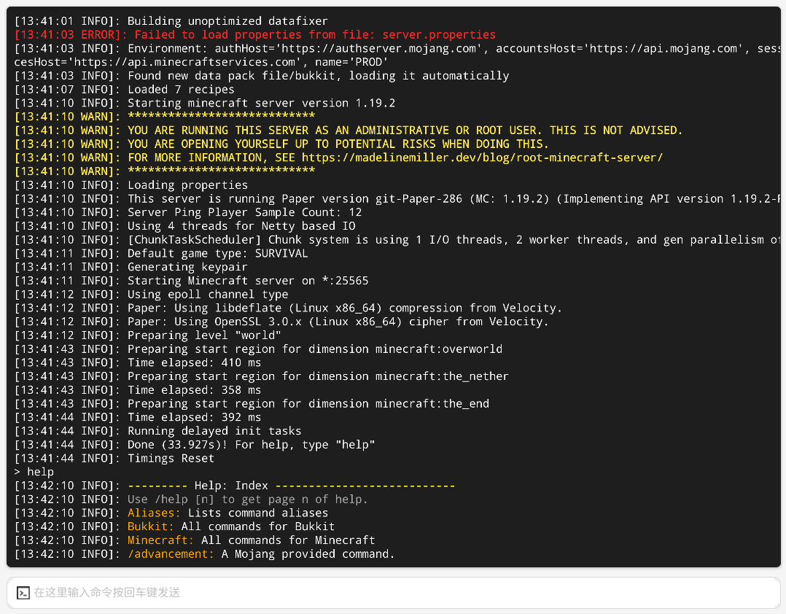

# 一键搭建 Minecraft Java 版服务器

## 1. 安装 Java 环境

在开始运行Java服务端之前 Java运行库是必不可少的.
以下是一些Minecraft版本所需的对应的Java版本运行库列表:

  - 1.7.x / 1.8.x / 1.9.x - 使用`Java7(不推荐)`或`Java8`运行
  - 1.10.x / 1.12.x - 使用`Java8`运行
  - 1.12.x / 1.13.x / 1.15.x - 使用`Java8`,`Java9`或`Java12`运行
  - 1.16.x - 使用`Java8`,`Java9`,`Java12`或`Java16`运行
  - 1.17.x - 使用`Java16`或`Java17`运行
  - 1.18.x - 使用Java17或Java18运行
  - 1.18.x / 1.19.x - 使用Java17或**更高版本**运行.

> `更高版本` 注意事项: Java20太新了 有很多东西可能不支持 推荐停留在Java19

> 您始终应该查看自己的插件支持哪些Java版本再做出抉择 如果插件没有声明 最好询问插件开发者 以免引起不必要的麻烦.
  
您可以在此处下载Java: `下列Java下载链接只适用于Windows 64位操作系统 如果您需要其它版本下载 请自行搜索`
  - [(Oracle)Java JDK8 8u202](https://repo.huaweicloud.com/java/jdk/8u202-b08/jdk-8u202-windows-x64.exe) `安装程序`
  - [(Azul)Java JDK8 8.0.362](https://cdn.azul.com/zulu/bin/zulu8.68.0.21-ca-jdk8.0.362-win_x64.zip) `压缩归档`
  - [(Azul)Java JDK11 11.0.18](https://cdn.azul.com/zulu/bin/zulu11.62.17-ca-jdk11.0.18-win_x64.msi) `安装程序`
  - [(Azul)Java JDK11 11.0.19](https://cdn.azul.com/zulu/bin/zulu11.64.19-ca-jdk11.0.19-win_x64.zip) `压缩归档`
  - [(Oracle)Java JDK17 17.0.7](https://download.oracle.com/java/17/latest/jdk-17_windows-x64_bin.exe) `安装程序`
  - [(Oracle)Java JDK17 17.0.7](https://download.oracle.com/java/17/archive/jdk-17.0.7_windows-x64_bin.zip) `压缩归档`

> 请找到适合您的计算机处理器架构以及操作系统合适的Java. **不要盲目地点击下载链接**  

> Java16以及更高版本仅可以在64位系统上运行.  

**如何使用压缩归档?**
如果您不想在您的电脑上安装Java 或者目前您不想更换主要的Java 那么使用一个压缩归档是一个比较好的选择.
您只需要将文件解压(文件夹最好不要带空格) 然后在启动参数内将开头的`java`替换成您的压缩归档运行库路径即可. 
`java路径/bin/java.exe`. 例如 `C:/Java/jdk-17.0.7/bin/java.exe ... -jar "你的jar文件名，例如：paper-1.19.4-516.jar"`

## 2.使用面板默认预设整合包一键开服

`请在使用时确定节点内有正确的java环境或在创建完毕后自行修改启动命令`

- 点击顶部应用实例并新建一个应用
- 选择Minecraft Java版游戏服务器
- 选择需部署的节点，选择Minecraft 快速部署
- 选择一个你需要的整合包，点击安装，输入实例名称
- 等待安装完毕后进入实例控制台
- 点击右上操作键开启服务器

